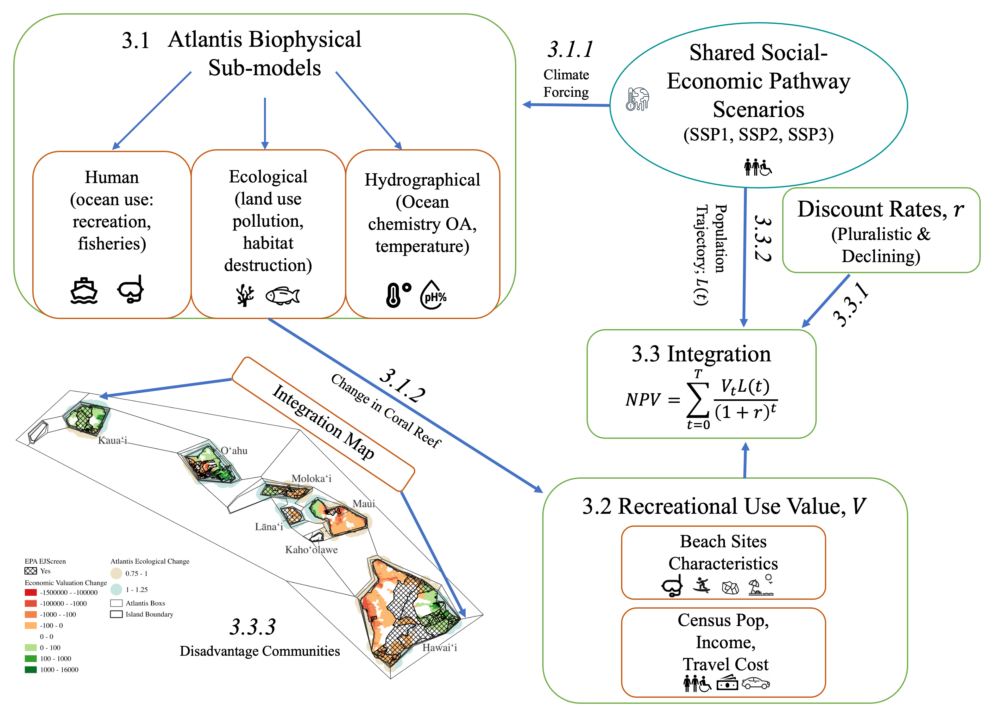

# Code for title: "The economic impact of climate change on coral reef in the Main Hawaiian Islands"
## author: "Ashley Lowe Mackenzie, Anders Dugstad, Carlo Fezzi, Lansing Perng, and Kirsten L.L. Oleson"

# [Click Here for interactive Website](https://loweas.github.io/CR/)

## Coral Reef Hawaii

The following code will produce predicts for changes welfare based on changes in conditions for nearshore environmental quality for the main Hawaii island. The main impact estimated is from losses of coral reef biomass. This is down through to models:

1.  An Economic Model using a random utility framework from [Fezzi. et al 2023](https://doi.org/10.1016/j.ecolecon.2022.107628)
2.  An Atlantic Model using a biophysical model which estimates changes to ecological conditions.

The graphical representation of this process is illustrated below

This repository contains the data, code, and outputs supporting the analysis of projected recreation-related welfare losses associated with coral reef decline across the Hawaiian Islands to 2100.

---

## Repository Structure

### Core files
| File | Description |
|------|-------------|
| `index.qmd` | Main analysis document rendered via Quarto. Contains the full analytical workflow from data preparation through results and discussion. |
| `about.qmd` | Project description and author information. |
| `_quarto.yml` | Quarto configuration file controlling rendering options, output format, and site structure. |
| `coral.Rproj` | R project file. Open this in RStudio to ensure correct working directory and relative file paths. |
| `references.bib` | BibTeX reference library for all citations used in the manuscript and analysis documents. |
| `styles.css` | CSS stylesheet controlling the visual formatting of the rendered HTML output. |

### Directories
| Directory | Description |
|-----------|-------------|
| `codedata/` | Input data files used in the analysis. Includes Atlantis ecological model outputs (coral biomass by polygon and scenario), SSP population projections for Hawaiʻi (Zoraghein & O'Neill, 2020), and the parameterised recreational demand model inputs. Files are in `.rds` and `.xlsx` format. |
| `images/` | Output figures generated by the analysis scripts, including coral cover projections, population trajectories, spatial welfare loss maps, and discount factor comparison figures. |
| `tables/` | Output tables in formatted form, including NPV welfare loss estimates by scenario and discounting approach, and supplementary discount rate and factor schedules. |
| `_site/` | Rendered HTML site output generated by Quarto. Do not edit files in this directory directly. |
| `CoralReef_files/` | Supporting files generated during Quarto rendering, including figure dependencies and cached outputs. |

## Data Sources

- **Ecological projections**: Atlantis ecosystem model outputs for coral biomass across nearshore polygons in Hawaiʻi under SSP1, SSP2, and SSP3 climate forcing derived from CMIP6.
- **Population projections**: State-level SSP population projections for Hawaiʻi from Zoraghein & O'Neill (2020) and Jiang et al. (2020).
- **Recreational demand model**: Travel cost model parameters and willingness-to-pay estimates derived from the existing literature and benefit transfer methods.
- **Environmental justice**: Community-level socioeconomic and environmental indicators from the US EPA EJScreen tool.

---

## Discounting Approaches

Two discounting approaches are applied to the stream of annual welfare losses:

1. **OMB declining rate** — follows OMB Circular A-4 (2023) with rates of 2.0% (years 1–59), 1.9% (years 60–74), and 1.8% (years 75–100), compounded year by year.
2. **Pluralistic discounting** — follows Costanza et al. (2021), applying capital-specific rates to each component of recreational welfare: 40% natural (0%), 10% social (0%), 30% human (3%), 20% built (10%).

Discount rate schedules and effective discount factors are reported in Supplementary Table A.2 and Figure A.5.

---

## Citation

Lowe Mackenzie, Ashley and Dugstad, Anders and Fezzi, Carlo and Perng, Lansing and Oleson, Kirsten, The economic impact of climate change on coral reef in the Main Hawaiian Islands. Available at SSRN: https://ssrn.com/abstract=5495504 or http://dx.doi.org/10.2139/ssrn.5495504