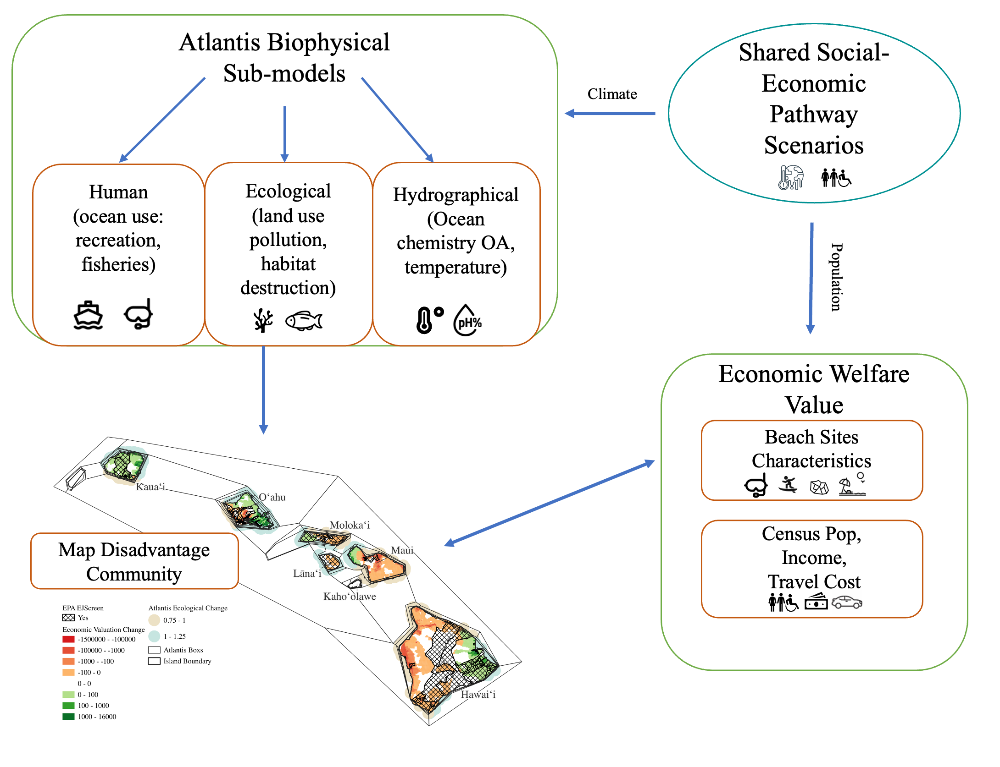
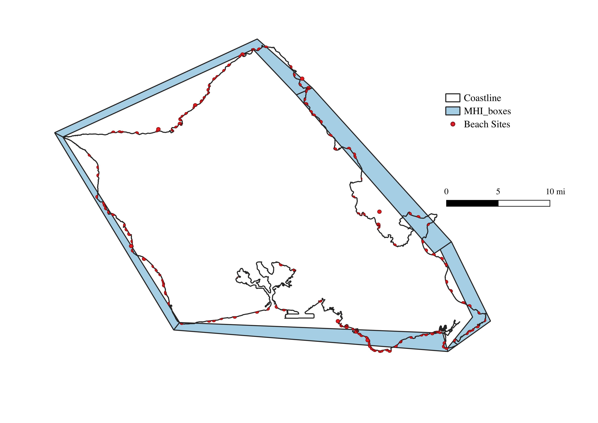
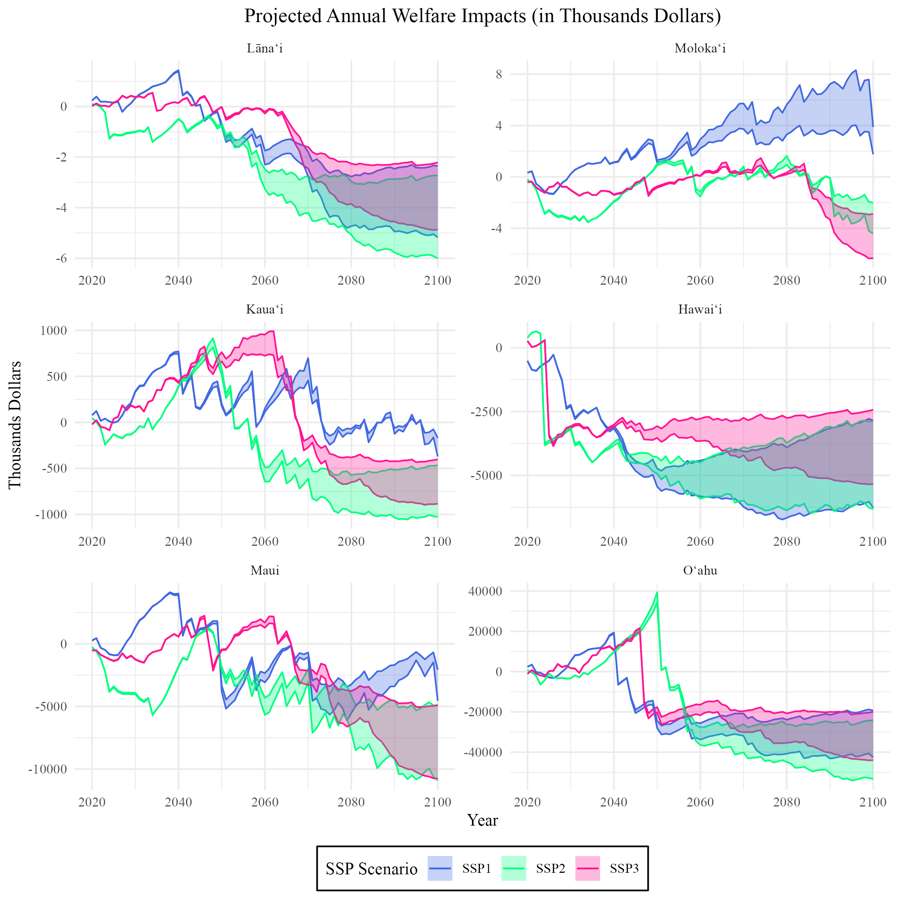
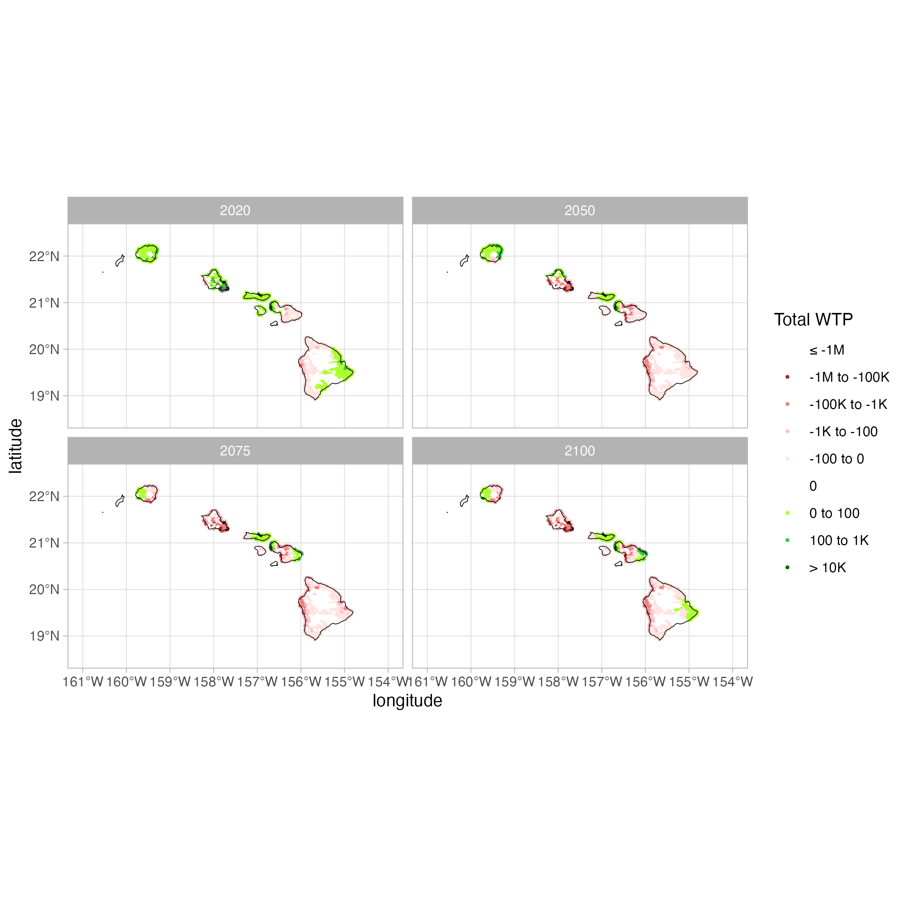
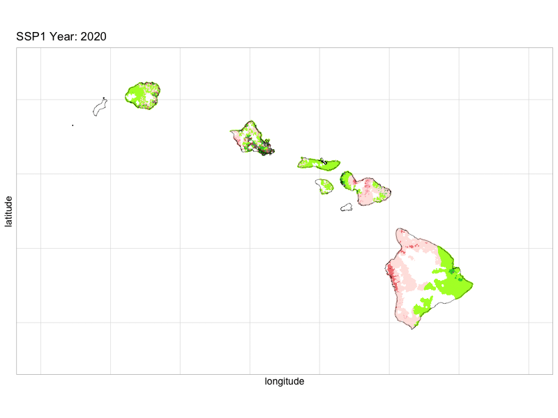
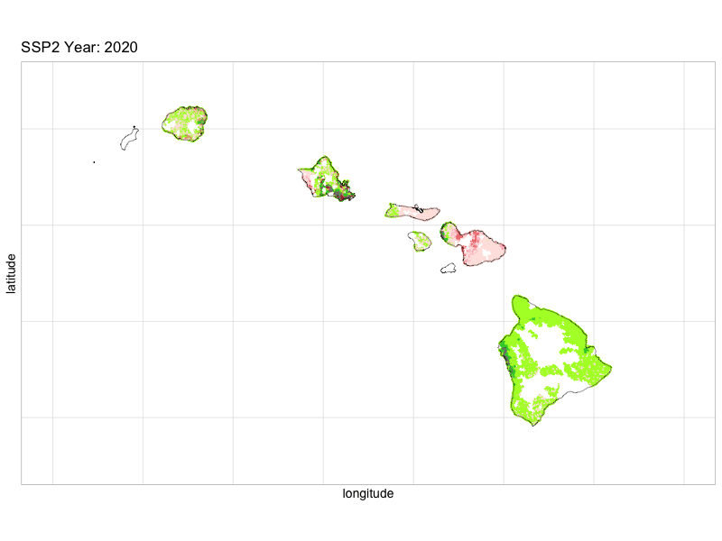
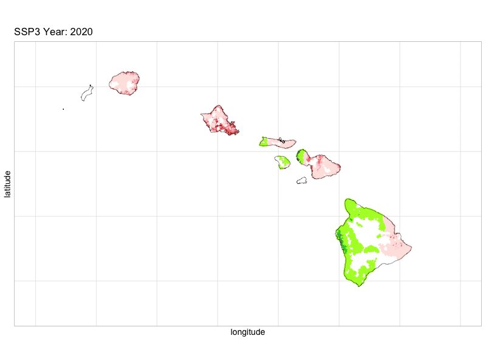

# CR
---
title: "The economic impact of climate change on coral reef in the Main Hawaiian Islands"
author: "Ashley Lowe Mackenzie et. al"
format:
  html:
    code-fold: true        # Enables dropdown for code
    code-tools: true       # (Optional) Adds buttons like "Show Code"
    code-summary: "Show code"  # (Optional) Custom label for dropdown
    toc: true
    toc-location: left
    page-layout: full
editor: visual
---

# Coral Reef Hawaii

The following code will produce predicts for changes welfare based on changes in conditions for nearshore environmental quality for the main Hawaii island. The main impact estimated is from losses of coral reef biomass. This is down through to models:

1.  An Economic Model using a random utility framework from [Fezzi. et al 2023](https://doi.org/10.1016/j.ecolecon.2022.107628)
2.  An Atlantic Model using a biophysical model which estimates changes to ecological conditions.

The graphical representation of this process is illustrated below



## Running Code

Call these libraries and the source codes from the Original Study. This will provide the coefficients from Random Utility model

```{r}


library(dplyr)
library(tidyr)
library(ggplot2)
library(sf)
library(gganimate)

### load functions

source("~/CR/codedata/dummier.R")
source("~/CR/codedata/travel_cost.R")
source("~/CR/codedata/gridplot.R")

### load model ###

load(file = "~/CR/codedata/model3.mod")

### this are the travel cost model estimates ###

m1


```

## Travel Cost

The following code will take the economic data collected from each island and calculate the travel cost for each grid to each location as previous estimated following Fezzi. et al 2023

```{r eval=FALSE}

dist1 <- read.csv("~/codedata/dist1.csv")
sites_join <- read.csv("~/codedata/sites_join.csv")

x1 <- merge(dist1, sites_join)
x1$coastal[x1$name == "Home"]=0 

### Prepared dataset for maps plot:

out <- x1[order(x1$siteID),]
out <- out[c(1,3,8:12)]
m

##using 85K because that was the survey amount
out$incometran_track=out$medincome_tract/85000
coasts <- sites[sites$coastal == 1 & sites$name!="Home",]


x1=merge(SSP1, x1, by.x = "polygon", by.y = "Box_ID_2", all.y = TRUE)

x1 <- x1[order(x1$km2_ID,x1$siteID),]	## btw it is correct that the dim(x) is lower than dim(dist) because
## I aggregated some sites
length(unique(x1$siteID))

### FINISHED LOADING AND MERGING DATASETS ###

#rm(dist, pop, sitesjoin)

### CALCULATE TRAVEL COST ####

x1$cost <- 0
x1$duration[ x1$siteID == 351] <- x1$duration[ x1$siteID == 351] + 40		## this sites needs 40min walking to be reached
## Need to also do this for Hawaii
### Change here for different fuel cost
x1$cost <- x1$distance.meters*0.001 * (0.20 / 1.5	)				## fuel cost 
## assumption on fuel cost:
#
# 20 miles/gallon
# $4.3/gallon
# means $4.3 per 20 miles --> 0.215 $/mile
# 10 km --> 6.2 miles --> $1.33 travel cost per km
# 10km * 0.20 / 1.5 = $1.33  so the values coincide with the cost used above.
x1$cost <- x1$cost + (x1$duration / 60)* 3/4 * 24.14 	## add the value of time (assuming a 25$ per hour average wage rate)
x1$cost <- x1$cost * 2 							## the value for a return trip
#### put Molokini cost equal to the one of Makena Landing Beach Park + 100$ (cost of a snorkeling tour)
x1$cost[x1$siteID == 388] <- x1$cost[x1$siteID == 359] + 100


```

## Atlantis Model

We will need to the outputs of biomass from Atlantis for the nearshore environment. These outputs will then be aggregated by polygon. The percentage change predict each year will provide us the unit that can be used in the Economic Model from previous section.

### Base level Coral

The base level of coral is the average biomass of 2015-2020 for each near polygon.



### Yearly Percent Change

Then for each time step out to 2100 we sum up the biomass of coral reef:

$C_{pt} = \sum V_{pt} / \sum V_{pt}=0$

The following code does this for scenario SSP1 1-3. The file required if from the Atlantis which is to large for github so please request.

```{r eval=FALSE}

library(dplyr)
library(tidyr)

###This grabs Atlantis and gets it into the write steps
SSP3_loPPkF <- readRDS("~/codedata/SSP3_control_last.rds")
biomass_spatial_stanza=SSP3_loPPkF$biomass_spatial_stanza
ssp3_coral=subset(biomass_spatial_stanza,species=="Pocillopora" |species=="Porites branching" |species=="Porites massive"|species=="Montipora"
                  |species=="Leptoseris")
ssp3_coral$time=round(ssp3_coral$time, digits = 0)
ssp3_coral=ssp3_coral %>% distinct(time, polygon, species, .keep_all = TRUE)
ssp3_coral=ssp3_coral %>% group_by(polygon, time) %>% summarize(Coral_NearShore=sum(atoutput))
ssp3_coral=ssp3_coral[ssp3_coral$polygon %in% keep, ]
ssp3_coral=ssp3_coral %>%
  filter(!(time %% 1))
ssp3_coral[order(ssp3_coral$time),]
ssp3_coral=ssp3_coral %>%
  filter(!(time <= 9))
t=ssp3_coral %>% filter(time<=14)%>% 
  group_by(polygon) %>% summarise(mean=mean(Coral_NearShore))
ssp3_coral=ssp3_coral %>%
  filter(!(time <= 13))
ssp3_coral=merge(t,ssp3_coral)
percentchangeSSP3=ssp3_coral %>%
  group_by(polygon) %>%
  mutate(Coral_perchange = Coral_NearShore/mean)
percentchangeSSP3=percentchangeSSP3[c(1,3,5)]
percentchangeSSP3$time<- sub("^", "time", percentchangeSSP3$time )
SSP3=spread(percentchangeSSP3, time, Coral_perchange)


SSP1_loPPkF <- readRDS("~/codedata/SSP1_control_last.rds")
biomass_spatial_stanza=SSP1_loPPkF$biomass_spatial_stanza
ssp1_coral=subset(biomass_spatial_stanza,species=="Pocillopora" |species=="Porites branching" |species=="Porites massive"|species=="Montipora"
                  |species=="Leptoseris")
ssp1_coral=ssp1_coral %>% group_by(polygon, time) %>% summarize(Coral_NearShore=sum(atoutput))
ssp1_coral=ssp1_coral[ssp1_coral$polygon %in% keep, ]
ssp1_coral=ssp1_coral %>%
  filter(!(time %% 1))
ssp1_coral[order(ssp1_coral$time),]

ssp1_coral=ssp1_coral %>%
  filter(!(time <= 9))
t=ssp1_coral %>% filter(time<=14)%>% 
  group_by(polygon) %>% summarise(mean=mean(Coral_NearShore))
ssp1_coral=ssp1_coral %>%
  filter(!(time <= 13))


ssp1_coral=merge(t,ssp1_coral)
percentchangeSSP1=ssp1_coral %>%
  group_by(polygon) %>%
  mutate(Coral_perchange = Coral_NearShore/mean)
percentchangeSSP1=percentchangeSSP1[c(1,3,5)]
percentchangeSSP1$time<- sub("^", "time", percentchangeSSP1$time )

SSP1=spread(percentchangeSSP1, time, Coral_perchange)

SSP2_loPPkF <- readRDS("~/codedata/SSP2_control_last.rds")
biomass_spatial_stanza=SSP2_loPPkF$biomass_spatial_stanza
ssp2_coral=subset(biomass_spatial_stanza,species=="Pocillopora" |species=="Porites branching" |species=="Porites massive"|species=="Montipora"
                  |species=="Leptoseris"| species=="crustose coralline algae")
ssp2_coral=ssp2_coral %>% group_by(polygon, time) %>% summarize(Coral_NearShore=sum(atoutput))
ssp2_coral=ssp2_coral[ssp2_coral$polygon %in% keep, ]
ssp2_coral=ssp2_coral %>%
  filter(!(time %% 1))
ssp2_coral[order(ssp2_coral$time),]

ssp2_coral=ssp2_coral %>%
  filter(!(time <= 9))
t=ssp2_coral %>% filter(time<=14)%>% 
  group_by(polygon) %>% summarise(mean=mean(Coral_NearShore))
ssp2_coral=ssp2_coral %>%
  filter(!(time <= 13))

ssp2_coral=merge(t,ssp2_coral)
percentchangeSSP2=ssp2_coral %>%
  group_by(polygon) %>%
  mutate(Coral_perchange = Coral_NearShore/mean)
percentchangeSSP2=percentchangeSSP2[c(1,3,5)]
percentchangeSSP2$time<- sub("^", "time", percentchangeSSP2$time )

SSP2=spread(percentchangeSSP2, time, Coral_perchange)


```

## Prediction Model

For each predicted scenario from Atlantis (ssp1-3) we will need to run a loop for each time step calculating the welfare changes for each grid and recreational location.

### Predict SSP1

This loop runs through each time step and calculate the compensating variation with each change in coral biomass overtime.

```{r eval=FALSE}
### parameters

beta <- m3$results[,1]


### Considering a transfer to Oahu:
x1[is.na(x1)] <- 0


X0 <- cbind( x1$cost,x1$home, x1$coastal, x1$citypark, x1$trailall,
             x1$haleakala, x1$molokini, x1$parking, x1$showers,
             x1$lifeguard, x1$rock, x1$manmade, x1$beachmedium, x1$beachlarge, x1$surf,
             x1$swim, x1$snork, x1$res_fish_bio, x1$PNAS, x1$playground, x1$sports,
             x1$snork*x1$PNAS, x1$snork*x1$res_fish_bio)

X0[is.na(X0)] <- 0


xsim <- x1
final <- data.frame(matrix(ncol =2, nrow = 0))
all <- data.frame(matrix(ncol =2, nrow = 0))
#colnames(final) <- c("time10",  "time20" , "time30" , "time40")
#this needs to be ran as a loop
for (i in 2:82) {
  xsim <- x1
  xsim$PNAS <- xsim$PNAS *xsim[,i]
  xsim$PNAS[xsim$PNAS <= 0] <- 0
  
  X1 <- cbind( xsim$cost,xsim$home, xsim$coastal, xsim$citypark, xsim$trailall,
               xsim$haleakala, xsim$molokini, xsim$parking, xsim$showers,
               xsim$lifeguard, xsim$rock, xsim$manmade, xsim$beachmedium, xsim$beachlarge, xsim$surf,
               xsim$swim, xsim$snork, xsim$res_fish_bio, xsim$PNAS, xsim$playground, xsim$sports,
               xsim$snork*xsim$PNAS, xsim$snork*xsim$res_fish_bio)
  
  X1[is.na(X1)] <- 0
  
  ### CALCULATION OF WTP FOR EACH GRID LOCATION
  
  wtpw <- quality.change(beta = beta, ### parameters
                         X0=X0, 	### X variables in the baseline
                         X1 = X1, 	#### X variables in the scenario
                         pid = x1$km2_ID,    ### ID of the 1km grid
                         cost =1)		### column of the cost parameter in the X matrix
  
  ### TOTAL WTP
  
  b=merge(wtpw,out, by.x=c("id"),by.y=c("km2_ID"))
  b$time=i
  a=b %>% group_by(island) %>% summarize(SSP1_block=sum(WTP * incometran_track*grid_km_censusblock_Pop18_densityKM * 365)
  )
  a$time=i
  all=rbind(b,all)
  final=rbind(a,final)
}
df=final
all_df=all
colnames(all_df)[2]="SSP1"


```

### Predict SSP2

```{r eval=FALSE}
####This is for SSP2

x1 <- merge(dist1, sites_join)
x1$coastal[x1$name == "Home"]=0 

x1=merge(SSP2, x1, by.x = "polygon", by.y = "Box_ID_2", all.y = TRUE)

x1 <- x1[order(x1$km2_ID,x1$siteID),]	## btw it is correct that the dim(x) is lower than dim(dist) because
## I aggregated some sites
length(unique(x1$siteID))

### FINISHED LOADING AND MERGING DATASETS ###

#rm(dist, pop, sitesjoin)

### CALCULATE TRAVEL COST ####

x1$cost <- 0
x1$duration[ x1$siteID == 351] <- x1$duration[ x1$siteID == 351] + 40		## this sites needs 40min walking to be reached
## Need to also do this for Hawaii


### Change here for different fuel cost

x1$cost <- x1$distance.meters*0.001 * (0.20 / 1.5	)				## fuel cost 

## assumption on fuel cost:
#
# 20 miles/gallon
# $4.3/gallon
# means $4.3 per 20 miles --> 0.215 $/mile
# 10 km --> 6.2 miles --> $1.33 travel cost per km
# 10km * 0.20 / 1.5 = $1.33  so the values coincide with the cost used above.

x1$cost <- x1$cost + (x1$duration / 60)* 3/4 * 24.14 	## add the value of time (assuming a 25$ per hour average wage rate)
x1$cost <- x1$cost * 2 							## the value for a return trip

#### put Molokini cost equal to the one of Makena Landing Beach Park + 100$ (cost of a snorkeling tour)

x1$cost[x1$siteID == 388] <- x1$cost[x1$siteID == 359] + 100


### PREPARE DATA FOR PREDICTIONS 

### parameters

beta <- m3$results[,1]


### Considering a transfer to Oahu:
x1[is.na(x1)] <- 0


X0 <- cbind( x1$cost,x1$home, x1$coastal, x1$citypark, x1$trailall,
             x1$haleakala, x1$molokini, x1$parking, x1$showers,
             x1$lifeguard, x1$rock, x1$manmade, x1$beachmedium, x1$beachlarge, x1$surf,
             x1$swim, x1$snork, x1$res_fish_bio, x1$PNAS, x1$playground, x1$sports,
             x1$snork*x1$PNAS, x1$snork*x1$res_fish_bio)

X0[is.na(X0)] <- 0


xsim <- x1
final <- data.frame(matrix(ncol =2, nrow = 0))
all <- data.frame(matrix(ncol =2, nrow = 0))
#colnames(final) <- c("time10",  "time20" , "time30" , "time40")
#this needs to be ran as a loop
for (i in 2:83) {
  xsim <- x1
  xsim$PNAS <- xsim$PNAS *xsim[,i]
  xsim$PNAS[xsim$PNAS <= 0] <- 0
  
  X1 <- cbind( xsim$cost,xsim$home, xsim$coastal, xsim$citypark, xsim$trailall,
               xsim$haleakala, xsim$molokini, xsim$parking, xsim$showers,
               xsim$lifeguard, xsim$rock, xsim$manmade, xsim$beachmedium, xsim$beachlarge, xsim$surf,
               xsim$swim, xsim$snork, xsim$res_fish_bio, xsim$PNAS, xsim$playground, xsim$sports,
               xsim$snork*xsim$PNAS, xsim$snork*xsim$res_fish_bio)
  
  X1[is.na(X1)] <- 0
  
  ### CALCULATION OF WTP FOR EACH GRID LOCATION
  
  wtpw <- quality.change(beta = beta, ### parameters
                         X0=X0, 	### X variables in the baseline
                         X1 = X1, 	#### X variables in the scenario
                         pid = x1$km2_ID,    ### ID of the 1km grid
                         cost =1)		### column of the cost parameter in the X matrix
  
  ### TOTAL WTP
  
  b=merge(wtpw,out, by.x=c("id"),by.y=c("km2_ID"))
  b$time=i
  a=b %>% group_by(island) %>% summarize(SSP2_block=sum(WTP * incometran_track*grid_km_censusblock_Pop18_densityKM * 365)
  )
  a$time=i
  all=rbind(b,all)
  final=rbind(a,final)
}

df=merge(df,final, all.x = TRUE)
colnames(all)[2]="SSP2"
all_df=merge(all_df, all, all.x = TRUE)


```

### Predict SSP3

```{r eval=FALSE}
####This is for SSP3

x1 <- merge(dist1, sites_join)
x1$coastal[x1$name == "Home"]=0 

x1=merge(SSP3, x1, by.x = "polygon", by.y = "Box_ID_2", all.y = TRUE)

x1 <- x1[order(x1$km2_ID,x1$siteID),]	## btw it is correct that the dim(x) is lower than dim(dist) because
## I aggregated some sites
length(unique(x1$siteID))

### FINISHED LOADING AND MERGING DATASETS ###


### CALCULATE TRAVEL COST ####

x1$cost <- 0
x1$duration[ x1$siteID == 351] <- x1$duration[ x1$siteID == 351] + 40		## this sites needs 40min walking to be reached
## Need to also do this for Hawaii


### Change here for different fuel cost

x1$cost <- x1$distance.meters*0.001 * (0.20 / 1.5	)				## fuel cost 

## assumption on fuel cost:
#
# 20 miles/gallon
# $4.3/gallon
# means $4.3 per 20 miles --> 0.215 $/mile
# 10 km --> 6.2 miles --> $1.33 travel cost per km
# 10km * 0.20 / 1.5 = $1.33  so the values coincide with the cost used above.

x1$cost <- x1$cost + (x1$duration / 60)* 3/4 * 24.14 	## add the value of time (assuming a 25$ per hour average wage rate)
x1$cost <- x1$cost * 2 							## the value for a return trip

#### put Molokini cost equal to the one of Makena Landing Beach Park + 100$ (cost of a snorkeling tour)

x1$cost[x1$siteID == 388] <- x1$cost[x1$siteID == 359] + 100


### PREPARE DATA FOR PREDICTIONS 

### parameters

beta <- m3$results[,1]


### Considering a transfer to Oahu:
x1[is.na(x1)] <- 0


X0 <- cbind( x1$cost,x1$home, x1$coastal, x1$citypark, x1$trailall,
             x1$haleakala, x1$molokini, x1$parking, x1$showers,
             x1$lifeguard, x1$rock, x1$manmade, x1$beachmedium, x1$beachlarge, x1$surf,
             x1$swim, x1$snork, x1$res_fish_bio, x1$PNAS, x1$playground, x1$sports,
             x1$snork*x1$PNAS, x1$snork*x1$res_fish_bio)

X0[is.na(X0)] <- 0


xsim <- x1
final <- data.frame(matrix(ncol =2, nrow = 0))
all <- data.frame(matrix(ncol =2, nrow = 0))
#colnames(final) <- c("time10",  "time20" , "time30" , "time40")
#this needs to be ran as a loop
for (i in 2:83) {
  xsim <- x1
  xsim$PNAS <- xsim$PNAS *xsim[,i]
  xsim$PNAS[xsim$PNAS <= 0] <- 0
  
  X1 <- cbind( xsim$cost,xsim$home, xsim$coastal, xsim$citypark, xsim$trailall,
               xsim$haleakala, xsim$molokini, xsim$parking, xsim$showers,
               xsim$lifeguard, xsim$rock, xsim$manmade, xsim$beachmedium, xsim$beachlarge, xsim$surf,
               xsim$swim, xsim$snork, xsim$res_fish_bio, xsim$PNAS, xsim$playground, xsim$sports,
               xsim$snork*xsim$PNAS, xsim$snork*xsim$res_fish_bio)
  
  X1[is.na(X1)] <- 0
  
  ### CALCULATION OF WTP FOR EACH GRID LOCATION
  
  wtpw <- quality.change(beta = beta, ### parameters
                         X0=X0, 	### X variables in the baseline
                         X1 = X1, 	#### X variables in the scenario
                         pid = x1$km2_ID,    ### ID of the 1km grid
                         cost =1)		### column of the cost parameter in the X matrix
  
  ### TOTAL WTP
  
  b=merge(wtpw,out, by.x=c("id"),by.y=c("km2_ID"))
  b$time=i
  a=b %>% group_by(island) %>% summarize(SSP3_block=sum(WTP * incometran_track*grid_km_censusblock_Pop18_densityKM * 365)
  )
  a$time=i
  all=rbind(b,all)
  final=rbind(a,final)
}

df=merge(df,final, all.x = TRUE)
colnames(all)[2]="SSP3"
all_df=merge(all_df, all, all.x = TRUE)

```

## Data Aggregation

Two datasets were created in the prediction modeling.

1.  Aggregated Totals by population and income weighted by Island Each Year
2.  Raw Welfare Predictions per KM Grid

```{r eval=FALSE}
all_df$SSP1_TotalWTP=(all_df$SSP1*all_df$incometran_track*all_df$grid_km_censusblock_Pop18_densityKM * 365) 
all_df$SSP2_TotalWTP=(all_df$SSP2*all_df$incometran_track*all_df$grid_km_censusblock_Pop18_densityKM * 365) 
all_df$SSP3_TotalWTP=(all_df$SSP3*all_df$incometran_track*all_df$grid_km_censusblock_Pop18_densityKM * 365) 


wtpssp1_total=all_df %>%
  filter(Year==2030 | Year==2050 | Year==2100)

df_long <- wtpssp1_total %>%
  pivot_longer(cols = starts_with("SSP"),
               names_to = "SSP_Var",
               values_to = "Value")

# Step 2: Create wide column names with Year info
df_long <- df_long %>%
  mutate(column_name = paste0("year_", Year, "_", SSP_Var))

# Step 3: Pivot wider using those column names
df_wide <- df_long %>%
  select(id, column_name, Value) %>%
  pivot_wider(names_from = column_name, values_from = Value)

write.csv(df_wide, file="allssps_islands.csv")

coral=SSP1[c(1,12,32,82)]
colnames(coral)[2]="SSP1_2030"
colnames(coral)[3]="SSP1_2050"
colnames(coral)[4]="SSP1_2100"

coral1=SSP2[c(1,12,32,82)]
colnames(coral1)[2]="SSP2_2030"
colnames(coral1)[3]="SSP2_2050"
colnames(coral1)[4]="SSP2_2100"

coral=merge(coral,coral1)

coral1=SSP3[c(1,12,32,82)]
colnames(coral1)[2]="SSP3_2030"
colnames(coral1)[3]="SSP3_2050"
colnames(coral1)[4]="SSP3_2100"

coral=merge(coral,coral1)
write.csv(coral, file="coral_new.csv")

df1=gather(df, condition, wtp, SSP1_block:SSP3_block, factor_key=TRUE)
df1$condition=gsub("_block", "", df1$condition)
df1$island=gsub("Kauai", "Kauaʻi", df1$island)
df1$island=gsub("Molokai", "Molokaʻi", df1$island)
df1$island=gsub("Oahu", "Oʻahu", df1$island)
df1$island=gsub("Hawaii", "Hawaiʻi", df1$island)
df1$island=gsub("Lanai", "Lānaʻi", df1$island)
write.csv(df1, file="allssps_islands.csv")

```

### Across Island aggregation

For the aggregated totals by island, this snipet will produce the projected table of total welfare loss using the circular A-4 discounting rate and a pluralistic discounting rate. We also incorporate the projected population growth under SSP1-SSP3 for the state of Hawaii.



```{r eval=FALSE}

library(readxl)
allssps_islands <- read_csv("~/CR/codedata/allssps_islands.csv") %>%
  select(-starts_with("..."))
                              
allssps_islandspop <- read_excel("allssps_islands.xlsx",
                                 sheet = "pop")


allssps_islandspop=gather(allssps_islandspop,  condition, pop, SSP1:SSP3, factor_key=TRUE)
allssps_islands=merge(allssps_islands,allssps_islandspop)

allssps_islands$NPV=0
allssps_islands$NPV[which(allssps_islands$Year>2020)]=.02
allssps_islands$NPV[which(allssps_islands$Year>2079)]=.019
allssps_islands$NPV[which(allssps_islands$Year>2094)]=.018
allssps_islands$time_step <- allssps_islands$Year - 2020


allssps_islands$NPV_WTP=allssps_islands$wtp/(1+allssps_islands$NPV)^allssps_islands$time_step
allssps_islands$NPV_WTP_Pop=(allssps_islands$wtp*allssps_islands$pop)/(1+allssps_islands$NPV)^allssps_islands$time_step
allssps_islands$NPV_WTP_pluristic=(allssps_islands$wtp*allssps_islands$pop*.4)/(1+0)^allssps_islands$time_step+(allssps_islands$wtp*allssps_islands$pop*.1)/(1)^allssps_islands$time_step+(allssps_islands$wtp*allssps_islands$pop*.3)/(1+.03)^allssps_islands$time_step+(allssps_islands$wtp*allssps_islands$pop*.2)/(1+.1)^allssps_islands$time_step

allssps_islands$NPV_WTP_pluristic2=(allssps_islands$wtp*allssps_islands$pop*.4)/(1+-.01)^allssps_islands$time_step+(allssps_islands$wtp*allssps_islands$pop*.1)/(1)^allssps_islands$time_step+(allssps_islands$wtp*allssps_islands$pop*.3)/(1+.01)^allssps_islands$time_step+(allssps_islands$wtp*allssps_islands$pop*.2)/(1+.5)^allssps_islands$time_step

allssps_islands$NPV_WTP_Lane=(allssps_islands$wtp*allssps_islands$pop)/(1+.03)^allssps_islands$time_step

allssps_islands$NPV_WTP_pluristic2=allssps_islands$NPV_WTP_pluristic2/1000
allssps_islands$NPV_WTP_Lane=allssps_islands$NPV_WTP_Lane/1000
allssps_islands$NPV_WTP_pluristic=allssps_islands$NPV_WTP_pluristic/1000
allssps_islands$NPV_WTP=allssps_islands$NPV_WTP/1000
allssps_islands$NPV_WTP_Pop=allssps_islands$NPV_WTP_Pop/1000
colnames(allssps_islands)[3]="SSP Scenario"


ggplot(allssps_islands, aes(x = Year)) +
  geom_line(aes(y = NPV_WTP_Pop, color = `SSP Scenario`, group = `SSP Scenario`)) +
  geom_line(aes(y = NPV_WTP_pluristic, color = `SSP Scenario`, group = `SSP Scenario`)) +
  geom_ribbon(
    aes(ymin = NPV_WTP_pluristic, ymax = NPV_WTP_Pop, fill = `SSP Scenario`, group = `SSP Scenario`),
    alpha = 0.3, linetype = 0
  ) +
  scale_color_manual(values = group.colors) +
  scale_fill_manual(values = group.colors) +
  theme_minimal() +
  theme(
    text = element_text(family = "Times New Roman"),
    plot.title = element_text(hjust = 0.5),
    legend.position = "bottom",
    legend.background = element_rect(fill = "white")
  ) +
  xlab("Year") +
  ylab("Thousands Dollars") +
  ggtitle("Projected Annual Welfare Impacts (in Thousands Dollars)") +
  facet_wrap(~ factor(island, levels = c("Lānaʻi", "Molokaʻi", "Kauaʻi", "Hawaiʻi", "Maui", "Oʻahu")),
             ncol = 2, scales = "free")


```

### Snap Shot within Island

The raw welfare estimates are not weighted by income or population. The next code snippet will calculate the the total WTP by income track and population density. This dataset could be of interest if you want to show how the welfare changes overtime.

For our paper, I took the snippets of the welfare and coral measurements from the years 2030, 2050 and 2100 and then improved the visuals I used qgis.

Here I have taken a snap shot of each year we will look at 2020, 2050, 2075 and 2100. Then map out each of the welfare of each km squared for each person.



```{r eval=FALSE}
#| eval: false
# Define the cutpoints for 7 intervals
all_df <- read_csv("~/CR/codedata/all_grids.csv")%>%
  select(-starts_with("..."))
all_df <- all_df %>%
  mutate(SSP1_WTP_bin = case_when(
    SSP1_TotalWTP <= -1e6         ~ "≤ -1M",
    SSP1_TotalWTP <= -1e5         ~ "-1M to -100K",
    SSP1_TotalWTP <= -1e3         ~ "-100K to -1K",
    SSP1_TotalWTP <= -100         ~ "-1K to -100",
    SSP1_TotalWTP < 0             ~ "-100 to 0",
    SSP1_TotalWTP == 0            ~ "0",
    SSP1_TotalWTP <= 100          ~ "0 to 100",
    SSP1_TotalWTP <= 1e3          ~ "100 to 1K",
    SSP1_TotalWTP <= 1e4          ~ "1K to 10K",
    TRUE                          ~ "> 10K"
  ))

all_df <- all_df %>%
  mutate(SSP2_WTP_bin = case_when(
    SSP2_TotalWTP <= -1e6         ~ "≤ -1M",
    SSP2_TotalWTP <= -1e5         ~ "-1M to -100K",
    SSP2_TotalWTP <= -1e3         ~ "-100K to -1K",
    SSP2_TotalWTP <= -100         ~ "-1K to -100",
    SSP2_TotalWTP < 0             ~ "-100 to 0",
    SSP2_TotalWTP == 0            ~ "0",
    SSP2_TotalWTP <= 100          ~ "0 to 100",
    SSP2_TotalWTP <= 1e3          ~ "100 to 1K",
    SSP2_TotalWTP <= 1e4          ~ "1K to 10K",
    TRUE                          ~ "> 10K"
  ))

all_df <- all_df %>%
  mutate(SSP3_WTP_bin = case_when(
    SSP3_TotalWTP <= -1e6         ~ "≤ -1M",
    SSP3_TotalWTP <= -1e5         ~ "-1M to -100K",
    SSP3_TotalWTP <= -1e3         ~ "-100K to -1K",
    SSP3_TotalWTP <= -100         ~ "-1K to -100",
    SSP3_TotalWTP < 0             ~ "-100 to 0",
    SSP3_TotalWTP == 0            ~ "0",
    SSP3_TotalWTP <= 100          ~ "0 to 100",
    SSP3_TotalWTP <= 1e3          ~ "100 to 1K",
    SSP3_TotalWTP <= 1e4          ~ "1K to 10K",
    TRUE                          ~ "> 10K"
  ))


color_palette <- c(
  "≤ -1M"         = "darkred",
  "-1M to -100K"  = "brown",
  "-100K to -1K"  = "lightcoral",
  "-1K to -100"   = "pink",
  "-100 to 0"     = "mistyrose",
  "0"             = "white",
  "0 to 100"      = "greenyellow",
  "100 to 1K"     = "limegreen",
  "> 10K"         = "darkgreen"
)

all_df$SSP1_WTP_bin <- factor(
  all_df$SSP1_WTP_bin,
  levels = names(color_palette)
)
all_df$SSP2_WTP_bin <- factor(
  all_df$SSP2_WTP_bin,
  levels = names(color_palette)
)
all_df$SSP2_WTP_bin <- factor(
  all_df$SSP2_WTP_bin,
  levels = names(color_palette)
)

# Then plot:
ggplot(all_df %>% filter(Year %in% c(2020, 2050, 2075, 2100)),
       aes(x = longitude, y = latitude, color = SSP1_WTP_bin)
) +
    geom_point(size = 0.5, alpha = 1) +
    geom_sf(
        data = hawaii_counties,
        fill = NA,
        color = "black",
        size = 0.4,
        inherit.aes = FALSE
    ) +
    coord_sf(xlim = c(-161, -154), ylim = c(18.5, 22.5)) +
    scale_color_manual(
        values = color_palette,
        name = "Total WTP",
        drop = FALSE,
        limits = names(color_palette)
    ) +
    facet_wrap(vars(Year), ncol = 2) +
    theme_light()


```

## Animation Welfare

These produce animations of changes in annual welfare to the year 2100

-   The code chunk runs the animation and saves the file.
-   The Markdown line right after brings the GIF into the rendered output.
-   Make sure the GIF file path is correct relative to the document, or specify the path if needed.

### SSP1



```{r eval=FALSE}
#| eval: false
base_map <- ggplot(all_df %>% filter(Year >= 2020 & Year <= 2100)) +

    geom_point(aes(x = longitude, y = latitude, color = SSP1_WTP_bin),
               size = 0.5, alpha = 1) +    geom_sf(data = hawaii_counties, fill = NA, color = "black", size = 0.5) +
    coord_sf(xlim = c(-161, -154), ylim = c(18.5, 22.5)) +
    scale_color_manual(
        values = color_palette,
        name = "Total WTP",
        drop = FALSE,
        limits = names(color_palette)
    ) +
    theme_light(base_size = 14) +
    labs(title = 'SSP1 Year: {closest_state}')

anim <- base_map +
    transition_states(Year, transition_length = 1, state_length = 1) +
    ease_aes('cubic-in-out') +
    shadow_wake(alpha = 0.3, wake_length = 0.2)

animate(anim, nframes = 81, fps = 10, width = 800, height = 600, renderer = gifski_renderer())
anim_save("hawaii_wtpssp1_animation.gif", animation = last_animation())


```

### SSP2



```{r eval=FALSE}
#| eval: false
base_map <- ggplot(all_df %>% filter(Year >= 2020 & Year <= 2100)) +

    geom_point(aes(x = longitude, y = latitude, color = SSP2_WTP_bin),
               size = 0.5, alpha = 1) +    geom_sf(data = hawaii_counties, fill = NA, color = "black", size = 0.5) +
    coord_sf(xlim = c(-161, -154), ylim = c(18.5, 22.5)) +
    scale_color_manual(
        values = color_palette,
        name = "Total WTP",
        drop = FALSE,
        limits = names(color_palette)
    ) +
    theme_light(base_size = 14) +
    labs(title = 'SSP2 Year: {closest_state}')

anim <- base_map +
    transition_states(Year, transition_length = 1, state_length = 1) +
    ease_aes('cubic-in-out') +
    shadow_wake(alpha = 0.3, wake_length = 0.2)

animate(anim, nframes = 81, fps = 10, width = 800, height = 600, renderer = gifski_renderer())
anim_save("hawaii_wtpssp2_animation.gif", animation = last_animation())
```

### SSP3



```{r eval=FALSE}
#| eval: false
base_map <- ggplot(all_df %>% filter(Year >= 2020 & Year <= 2100)) +

    geom_point(aes(x = longitude, y = latitude, color = SSP3_WTP_bin),
               size = 0.5, alpha = 1) +    geom_sf(data = hawaii_counties, fill = NA, color = "black", size = 0.5) +
    coord_sf(xlim = c(-161, -154), ylim = c(18.5, 22.5)) +
    scale_color_manual(
        values = color_palette,
        name = "Total WTP",
        drop = FALSE,
        limits = names(color_palette)
    ) +
    theme_light(base_size = 14) +
    labs(title = 'SSP3 Year: {closest_state}')

anim <- base_map +
    transition_states(Year, transition_length = 1, state_length = 1) +
    ease_aes('cubic-in-out') +
    shadow_wake(alpha = 0.3, wake_length = 0.2)

animate(anim, nframes = 81, fps = 10, width = 800, height = 600, renderer = gifski_renderer())
anim_save("hawaii_wtpssp3_animation.gif", animation = last_animation())
```

### 
