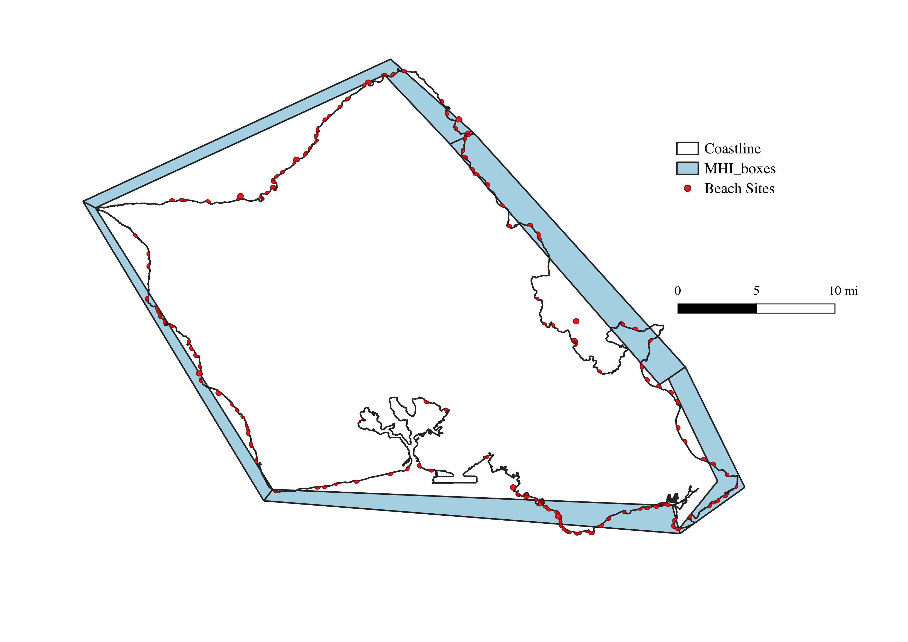
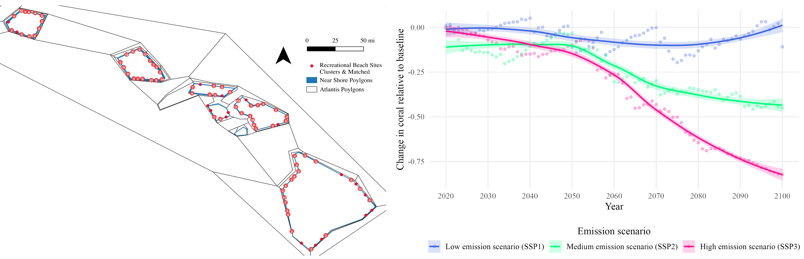
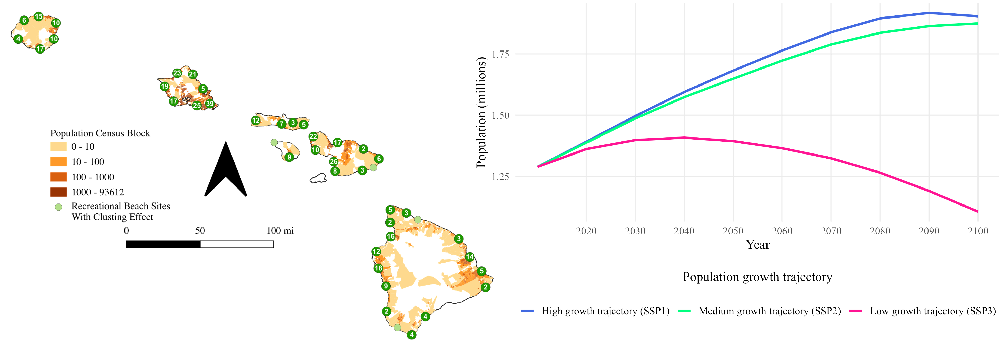
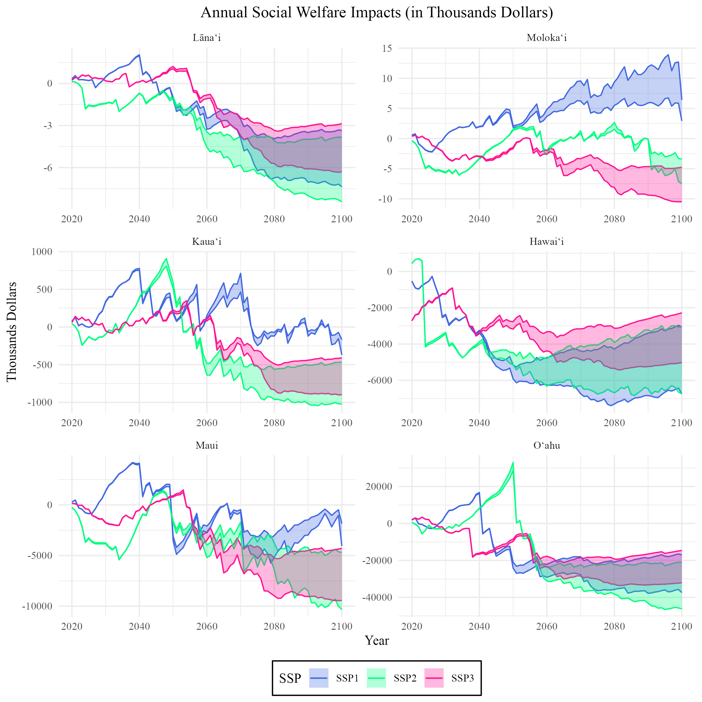
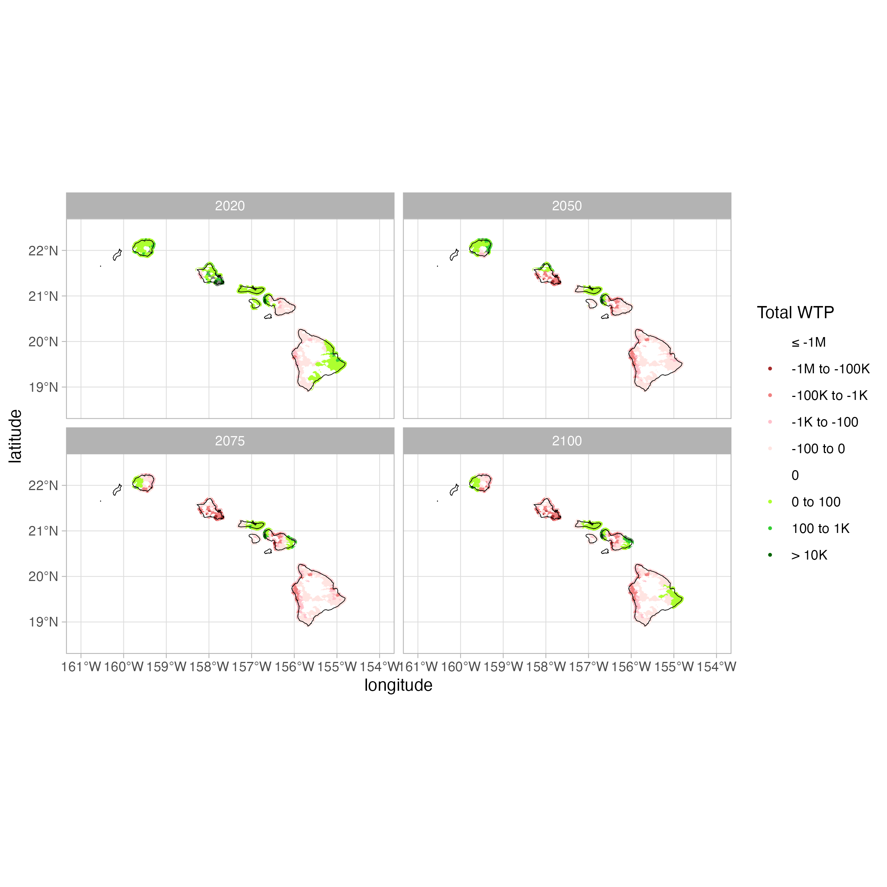
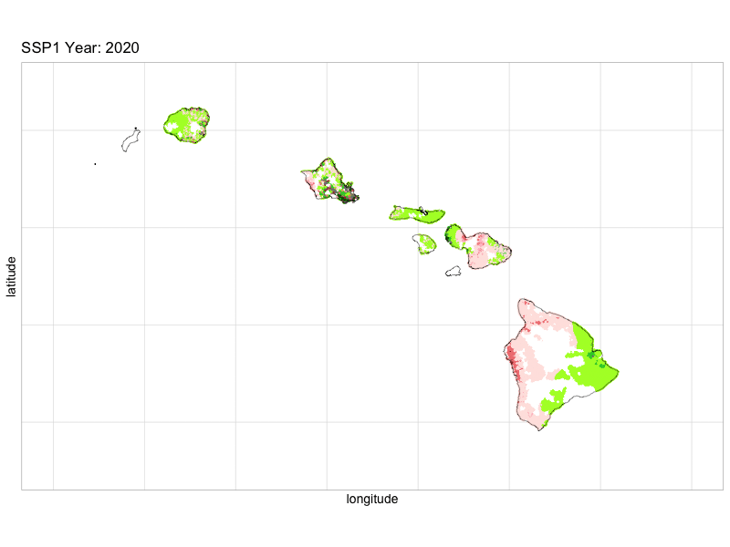
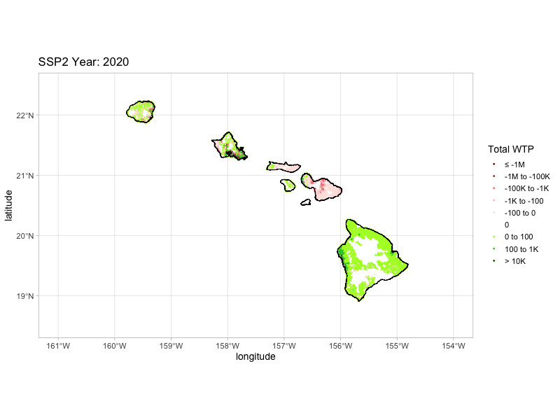
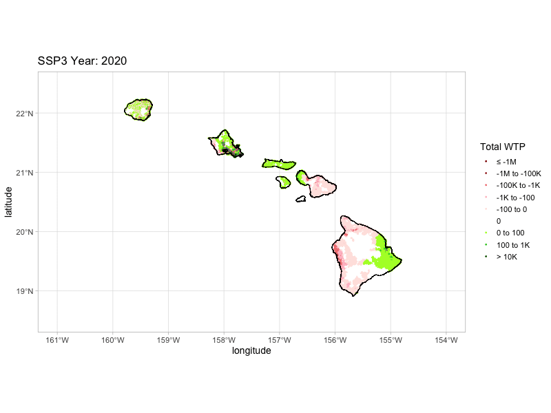

# Coral Reef Hawaii

The following code estimates welfare changes associated with varying conditions of nearshore environmental quality on the island of Hawai'i. The primary impact considered is the loss of coral reef biomass, which serves as an environmental and economic asset. Welfare effects are estimated through two distinct models that capture changes in household utility and behavioral responses to environmental degradation. These models use observed visitation and population data to approximate demand, and they translate changes in reef quality into utility impacts, following standard approaches in environmental and recreational economics. The two models include:

1.  An Economic Model using a random utility framework from [Fezzi. et al 2023](https://doi.org/10.1016/j.ecolecon.2022.107628)
2.  Atlantic Biophysical Sub-Model which estimates changes to ecological conditions.

The graphical representation of this process is illustrated below


# Running Code

This section calls the necessary R packages and sources external scripts from the original study. These scripts provide the estimated coefficients from the Random Utility Model (RUM), which will be used to simulate individual preferences and estimate welfare changes under different environmental quality scenarios. These parameters reflect the marginal utility of various site attributes, including coral reef biomass, travel cost, and environmental conditions.

```{r eval=FALSE}
library(sf)
library(dplyr)
library(tidyr)
library(ggplot2)
library(sf)
library(gganimate)

### load functions

getwd()
source("codedata/dummier.R")
source("codedata/travel_cost.R")
source("codedata/gridplot.R")

### load model ###

load(file = "codedata/model3.mod")

### this are the travel cost model estimates ###

m1

```

# Atlantis Model

To assess environmental changes in the nearshore ecosystem, we incorporate biomass outputs from the Atlantis ecosystem model. These outputs represent projected ecological dynamics---specifically, coral reef and associated species biomass---under different management and environmental scenarios.

The biomass values will be:

-   Spatially aggregated by polygon to match the resolution used in the economic model.

-   Processed annually to calculate percentage changes in biomass relative to the baseline year.

These percentage changes provide the key environmental quality metric (e.g., reef health) that feeds into the Economic Model outlined in the previous section. Specifically, the estimated changes will modify site attributes within the Random Utility Model framework to simulate how changes in reef biomass affect recreational behavior and welfare.

## Base level Coral

The base level of coral is the average biomass of 2015-2020 for each near polygon.



## Yearly Relative Change

Then for each time step out to 2100 we sum up the biomass of coral reef:

$C_{pt} = \sum V_{pt} / \sum V_{pt}=0$

The following code does this for scenario SSP1 1-3. This looks at the relative change of coral biomass within each polygon in the nearshore environment.



```{r eval=FALSE}

library(dplyr)
library(tidyr)
x1 <- readRDS("codedata/x1.rds")

keep=unique(x1$Box_ID_2)
###This grabs Atlantis and gets it into the write steps
SSP3_loPPkF <- readRDS("codedata/SSP3_control_last.rds")
biomass_spatial_stanza=SSP3_loPPkF$cover
ssp3_coral=subset(biomass_spatial_stanza,species=="Pocillopora" |species=="Porites branching" |species=="Porites massive"|species=="Montipora"
                  |species=="Leptoseris")
ssp3_coral$time=round(ssp3_coral$time, digits = 0)
ssp3_coral=ssp3_coral %>% distinct(time, polygon, species, .keep_all = TRUE)
ssp3_coral=ssp3_coral %>% group_by(polygon, time) %>% summarize(Coral_NearShore=sum(atoutput))
ssp3_coral=ssp3_coral[ssp3_coral$polygon %in% keep, ]
ssp3_coral=ssp3_coral %>%
  filter(!(time %% 1))
ssp3_coral[order(ssp3_coral$time),]
ssp3_coral=ssp3_coral %>%
  filter(!(time <= 9))
t=ssp3_coral %>% filter(time<=14)%>% 
  group_by(polygon) %>% summarise(mean=mean(Coral_NearShore))
ssp3_coral=ssp3_coral %>%
  filter(!(time <= 13))
ssp3_coral=merge(t,ssp3_coral)
percentchangeSSP3=ssp3_coral %>%
  group_by(polygon) %>%
  mutate(Coral_perchange = (Coral_NearShore)/mean)
percentchangeSSP3=percentchangeSSP3[c(1,3,5)]
percentchangeSSP3$time<- sub("^", "time", percentchangeSSP3$time )
SSP3=spread(percentchangeSSP3, time, Coral_perchange)


SSP1_loPPkF <- readRDS("codedata/SSP1_control_last.rds")
biomass_spatial_stanza=SSP1_loPPkF$cover
ssp1_coral=subset(biomass_spatial_stanza,species=="Pocillopora" |species=="Porites branching" |species=="Porites massive"|species=="Montipora"
                  |species=="Leptoseris")
ssp1_coral=ssp1_coral %>% group_by(polygon, time) %>% summarize(Coral_NearShore=sum(atoutput))
ssp1_coral=ssp1_coral[ssp1_coral$polygon %in% keep, ]
ssp1_coral=ssp1_coral %>%
  filter(!(time %% 1))
ssp1_coral[order(ssp1_coral$time),]

ssp1_coral=ssp1_coral %>%
  filter(!(time <= 9))
t=ssp1_coral %>% filter(time<=14)%>% 
  group_by(polygon) %>% summarise(mean=mean(Coral_NearShore))
ssp1_coral=ssp1_coral %>%
  filter(!(time <= 13))


ssp1_coral=merge(t,ssp1_coral)
percentchangeSSP1=ssp1_coral %>%
  group_by(polygon) %>%
  mutate(Coral_perchange = (Coral_NearShore)/mean)
percentchangeSSP1=percentchangeSSP1[c(1,3,5)]
percentchangeSSP1$time<- sub("^", "time", percentchangeSSP1$time )

SSP1=spread(percentchangeSSP1, time, Coral_perchange)

SSP2_loPPkF <- readRDS("codedata/SSP2_control_last.rds")
biomass_spatial_stanza=SSP2_loPPkF$cover
ssp2_coral=subset(biomass_spatial_stanza,species=="Pocillopora" |species=="Porites branching" |species=="Porites massive"|species=="Montipora"
                  |species=="Leptoseris"| species=="crustose coralline algae")
ssp2_coral=ssp2_coral %>% group_by(polygon, time) %>% summarize(Coral_NearShore=sum(atoutput))
ssp2_coral=ssp2_coral[ssp2_coral$polygon %in% keep, ]
ssp2_coral=ssp2_coral %>%
  filter(!(time %% 1))
ssp2_coral[order(ssp2_coral$time),]

ssp2_coral=ssp2_coral %>%
  filter(!(time <= 9))
t=ssp2_coral %>% filter(time<=14)%>% 
  group_by(polygon) %>% summarise(mean=mean(Coral_NearShore))
ssp2_coral=ssp2_coral %>%
  filter(!(time <= 13))

ssp2_coral=merge(t,ssp2_coral)
percentchangeSSP2=ssp2_coral %>%
  group_by(polygon) %>%
  mutate(Coral_perchange = (Coral_NearShore)/mean)
percentchangeSSP2=percentchangeSSP2[c(1,3,5)]
percentchangeSSP2$time<- sub("^", "time", percentchangeSSP2$time )

SSP2=spread(percentchangeSSP2, time, Coral_perchange)

percentchangeSSP1 <- percentchangeSSP1 %>% mutate(SSP = "SSP1")
percentchangeSSP2 <- percentchangeSSP2 %>% mutate(SSP = "SSP2")
percentchangeSSP3 <- percentchangeSSP3 %>% mutate(SSP = "SSP3")
coral_graph=rbind(percentchangeSSP1,percentchangeSSP2,percentchangeSSP3)

rm(ssp1_coral,SSP1_loPPkF,ssp2_coral,SSP2_loPPkF, ssp3_coral,SSP3_loPPkF,percentchangeSSP1,percentchangeSSP2,percentchangeSSP3, biomass_spatial_stanza
```

## Graph

This shows the overall predicted relative change in coral cover across each scenario.

```{r eval=FALSE}
coral1 <- coral_graph %>%
  mutate(
    time_step = as.numeric(gsub("time", "", time)) + 2006
  ) %>%
  filter(time_step <= 2100) %>%
  group_by(SSP, time_step) %>%
  summarize(mean_coral = mean(Coral_perchange), .groups = "drop") %>%
  mutate(
    percentage = mean_coral - 1,
    SSP_label = recode(SSP,
      SSP1 = "Low emission scenario (SSP1)",
      SSP2 = "Medium emission scenario (SSP2)",
      SSP3 = "High emission scenario (SSP3)"
    ),
    SSP_label = factor(SSP_label, levels = c(
      "Low emission scenario (SSP1)",
      "Medium emission scenario (SSP2)",
      "High emission scenario (SSP3)"
    ))
  )

group.colors <- c(
  "Low emission scenario (SSP1)"    = "royalblue",
  "Medium emission scenario (SSP2)" = "springgreen",
  "High emission scenario (SSP3)"   = "deeppink"
)

ggplot(coral1, aes(x = time_step, y = percentage,
                   color = SSP_label, fill = SSP_label, group = SSP_label)) +
    geom_point(alpha = 0.3) +
    geom_smooth(method = "loess", se = TRUE, alpha = 0.2) +
    scale_color_manual(values = group.colors) +
    scale_fill_manual(values  = group.colors) +
    scale_x_continuous(breaks = seq(2020, 2100, 10)) +
    labs(
        x     = "Year",
        y     = "Change in coral relative to baseline",
        color = "Emission scenario",
        fill  = "Emission scenario"
    ) +
    theme_minimal(base_size = 14, base_family = "Times New Roman") +
    theme(
        plot.title            = element_text(hjust = 0.5),
        legend.position       = "bottom",
        legend.title.position = "top",
        legend.title          = element_text(family = "Times New Roman", hjust = 0.5),
        legend.text           = element_text(family = "Times New Roman"),
        panel.grid.minor      = element_blank()
    ) +
    guides(color = guide_legend(nrow = 1),
           fill  = guide_legend(nrow = 1))

ggsave("images/coral_scenario.png", dpi = 300, height = 5, width = 8, units = "in")
```

# Population

The following code shows the predicted change in population under scenario SSP1 1-3 using the data available for state of Hawaii @zoraghein2020



```{r eval=FALSE}
library(readxl)
pop <- read_excel("codedata/population_Zoragheinetal2020.xlsx")
pop$Population <- as.numeric(pop$Population)
pop <- pop %>%
    group_by(Scenario) %>%
    mutate(
        BasePop           = Population[Year == 2020],
        Population_weight = Population / BasePop
    ) %>%
    ungroup()

pop <- pop %>%
  mutate(across(c(Scenario), toupper)) %>%
  subset(Scenario != "SSP5" & Scenario != "SSP4") %>%
  # Rename scenarios to reflect population trajectory framing per reviewer
  mutate(
    Scenario_label = recode(Scenario,
      SSP1 = "High growth trajectory (SSP1)",
      SSP2 = "Medium growth trajectory (SSP2)",
      SSP3 = "Low growth trajectory (SSP3)"
    ),
    # Preserve factor order
    Scenario_label = factor(Scenario_label, levels = c(
      "High growth trajectory (SSP1)",
      "Medium growth trajectory (SSP2)",
      "Low growth trajectory (SSP3)"
    ))
  )

group.colors <- c(
  "High growth trajectory (SSP1)"   = "royalblue",
  "Medium growth trajectory (SSP2)" = "springgreen",
  "Low growth trajectory (SSP3)"    = "deeppink"
)

ggplot(pop, aes(x     = Year,
                y     = Population / 1000000,
                color = Scenario_label,
                group = Scenario_label)) +
    geom_line(linewidth = 1.2) +
    scale_color_manual(values = group.colors) +
    scale_x_continuous(breaks = seq(2020, 2100, 10)) +
    labs(
        x     = "Year",
        y     = "Population (millions)",
        color = "Population growth trajectory\n"
    ) +
    theme_minimal(base_size = 14, base_family = "Times New Roman") +
    theme(
        plot.title               = element_text(hjust = 0.5),
        legend.position          = "bottom",
        legend.title.position    = "top",
        legend.title             = element_text(family = "Times New Roman", hjust = 0.5),
        legend.text              = element_text(family = "Times New Roman"),
        panel.grid.minor         = element_blank()
    ) +
    guides(color = guide_legend(nrow = 1))

ggsave("images/population_scenario.png", dpi = 300, height = 5, width = 8, units = "in")
```

# Travel Cost

The following code calculates the **travel cost** from each residential grid to each recreation site across the Hawaiian Islands. It uses economic and geographic data collected from each island, including household income, travel distance, and mode assumptions.

Travel costs are estimated following the methodology of **Fezzi et al. (2023)**, who incorporate both time and monetary expenses into a unified measure of generalized cost. These estimates serve as one of the key explanatory variables in the Random Utility Model (RUM), which is used to simulate recreation site choice.

# Prediction Model

For each scenario predicted by the Atlantis ecosystem model (e.g., SSP1, SSP2, SSP3), we run a simulation loop across all time steps to estimate the welfare impacts of changing nearshore coral biomass.

Specifically, for each year in the scenario:

-   Biomass outputs are aggregated spatially (by polygon or site).

-   The percentage change in coral reef biomass relative to the baseline is calculated.

-   These changes are passed into the Random Utility Model, updating site attributes for each grid-cell household.

-   Compensating Variation (CV) is then computed to measure the change in household welfare due to environmental change.

This process is repeated for each:

-   Grid cell (representing origin locations of visitors)

-   Recreational site (destination choices)

-   Time step (e.g., yearly from 2025 to 2100)

-   Scenario (SSP1--3)

## Predict SSP1

Below is a loop (conceptual or in code) that:

-   Iterates through each time step of the SSP1 scenario

-   Updates coral biomass conditions

-   Recalculates utilities and choice probabilities

-   Estimates welfare change (CV) for each grid-location pair

```{r eval=FALSE}
### parameters

x1 <- readRDS("codedata/x1.rds")
x1$coastal[x1$name == "Home"]=0 

### Prepared dataset for maps plot:

out <- x1[order(x1$siteID),]
out <- out[c(1,3,8:12)]
out=out[!duplicated(out[2]),]

##using 85K because that was the survey amount
out$incometran_track=out$medincome_tract/85000
sites_join <- read.csv("codedata/sites_join.csv")
coasts <- sites_join[sites_join$coastal == 1 & sites_join$name!="Home",]


x1=merge(SSP1, x1, by.x = "polygon", by.y = "Box_ID_2", all.y = TRUE)

x1 <- x1[order(x1$km2_ID,x1$siteID),]	## btw it is correct that the dim(x) is lower than dim(dist) because
## I aggregated some sites
length(unique(x1$siteID))

### FINISHED LOADING AND MERGING DATASETS ###

#rm(dist, pop, sitesjoin)

### CALCULATE TRAVEL COST ####

x1$cost <- 0
x1$duration[ x1$siteID == 351] <- x1$duration[ x1$siteID == 351] + 40		## this sites needs 40min walking to be reached
## Need to also do this for Hawaii
### Change here for different fuel cost
x1$cost <- x1$distance.meters*0.001 * (0.20 / 1.5	)				## fuel cost 
## assumption on fuel cost:
#
# 20 miles/gallon
# $4.3/gallon
# means $4.3 per 20 miles --> 0.215 $/mile
# 10 km --> 6.2 miles --> $1.33 travel cost per km
# 10km * 0.20 / 1.5 = $1.33  so the values coincide with the cost used above.
x1$cost <- x1$cost + (x1$duration / 60)* 3/4 * 24.4	## add the value of time (assuming a 25$ per hour average wage rate)
x1$cost <- x1$cost * 2 							## the value for a return trip
#### put Molokini cost equal to the one of Makena Landing Beach Park + 100$ (cost of a snorkeling tour)
x1$cost[x1$siteID == 388] <- x1$cost[x1$siteID == 359] + 100


beta <- m1$results[,1]


X0 <- cbind( x1$cost,x1$home, x1$coastal, x1$citypark, x1$trailall,
             x1$haleakala, x1$molokini, x1$parking, x1$showers,
             x1$lifeguard, x1$rock, x1$manmade, x1$beachmedium, x1$beachlarge, x1$surf,
             x1$swim, x1$snork, x1$res_fish_bio, x1$PNAS, x1$playground, x1$sports,
             x1$snork*x1$PNAS, x1$snork*x1$res_fish_bio)

X0[is.na(X0)] <- 0


xsim <- x1
final <- data.frame(matrix(ncol =2, nrow = 0))
all <- data.frame(matrix(ncol =2, nrow = 0))
#colnames(final) <- c("time10",  "time20" , "time30" , "time40")
#this needs to be ran as a loop
for (i in 2:82) {
  xsim <- x1
  xsim$PNAS <- xsim$PNAS *xsim[,i]
  xsim$PNAS[xsim$PNAS <= 0] <- 0
  
  X1 <- cbind( xsim$cost,xsim$home, xsim$coastal, xsim$citypark, xsim$trailall,
               xsim$haleakala, xsim$molokini, xsim$parking, xsim$showers,
               xsim$lifeguard, xsim$rock, xsim$manmade, xsim$beachmedium, xsim$beachlarge, xsim$surf,
               xsim$swim, xsim$snork, xsim$res_fish_bio, xsim$PNAS, xsim$playground, xsim$sports,
               xsim$snork*xsim$PNAS, xsim$snork*xsim$res_fish_bio)
  
  X1[is.na(X1)] <- 0
  
  ### CALCULATION OF WTP FOR EACH GRID LOCATION
  
  wtpw <- quality.change(beta = beta, ### parameters
                         X0=X0, 	### X variables in the baseline
                         X1 = X1, 	#### X variables in the scenario
                         pid = x1$km2_ID,    ### ID of the 1km grid
                         cost =1)		### column of the cost parameter in the X matrix
  
  ### TOTAL WTP
  
  b=merge(wtpw,out, by.x=c("id"),by.y=c("km2_ID"))
  b$time=i
  a=b %>% group_by(island) %>% summarize(SSP1_block=sum(WTP *grid_km_censusblock_Pop18_densityKM * 365)
  )
  a$time=i
  all=rbind(b,all)
  final=rbind(a,final)
}

df=final
all_df=all
colnames(all_df)[2]="SSP1"


```

## Predict SSP2

```{r eval=FALSE}
x1 <- readRDS("codedata/x1.rds")

x1=merge(SSP2, x1, by.x = "polygon", by.y = "Box_ID_2", all.y = TRUE)

x1 <- x1[order(x1$km2_ID,x1$siteID),]	## btw it is correct that the dim(x) is lower than dim(dist) because
## I aggregated some sites
length(unique(x1$siteID))

### FINISHED LOADING AND MERGING DATASETS ###

#rm(dist, pop, sitesjoin)

### CALCULATE TRAVEL COST ####

x1$cost <- 0
x1$duration[ x1$siteID == 351] <- x1$duration[ x1$siteID == 351] + 40		## this sites needs 40min walking to be reached
## Need to also do this for Hawaii
### Change here for different fuel cost
x1$cost <- x1$distance.meters*0.001 * (0.20 / 1.5	)				## fuel cost 
## assumption on fuel cost:
#
# 20 miles/gallon
# $4.3/gallon
# means $4.3 per 20 miles --> 0.215 $/mile
# 10 km --> 6.2 miles --> $1.33 travel cost per km
# 10km * 0.20 / 1.5 = $1.33  so the values coincide with the cost used above.
x1$cost <- x1$cost + (x1$duration / 60)* 3/4 * 24.4
x1$cost <- x1$cost * 2 							## the value for a return trip
#### put Molokini cost equal to the one of Makena Landing Beach Park + 100$ (cost of a snorkeling tour)
x1$cost[x1$siteID == 388] <- x1$cost[x1$siteID == 359] + 100


### PREPARE DATA FOR PREDICTIONS 

### parameters

beta <- m1$results[,1]


X0 <- cbind( x1$cost,x1$home, x1$coastal, x1$citypark, x1$trailall,
             x1$haleakala, x1$molokini, x1$parking, x1$showers,
             x1$lifeguard, x1$rock, x1$manmade, x1$beachmedium, x1$beachlarge, x1$surf,
             x1$swim, x1$snork, x1$res_fish_bio, x1$PNAS, x1$playground, x1$sports,
             x1$snork*x1$PNAS, x1$snork*x1$res_fish_bio)

X0[is.na(X0)] <- 0


xsim <- x1
final <- data.frame(matrix(ncol =2, nrow = 0))
all <- data.frame(matrix(ncol =2, nrow = 0))
#colnames(final) <- c("time10",  "time20" , "time30" , "time40")
#this needs to be ran as a loop
for (i in 2:83) {
  xsim <- x1
  xsim$PNAS <- xsim$PNAS *xsim[,i]
  xsim$PNAS[xsim$PNAS <= 0] <- 0
  
  X1 <- cbind( xsim$cost,xsim$home, xsim$coastal, xsim$citypark, xsim$trailall,
               xsim$haleakala, xsim$molokini, xsim$parking, xsim$showers,
               xsim$lifeguard, xsim$rock, xsim$manmade, xsim$beachmedium, xsim$beachlarge, xsim$surf,
               xsim$swim, xsim$snork, xsim$res_fish_bio, xsim$PNAS, xsim$playground, xsim$sports,
               xsim$snork*xsim$PNAS, xsim$snork*xsim$res_fish_bio)
  
  X1[is.na(X1)] <- 0
  
  ### CALCULATION OF WTP FOR EACH GRID LOCATION
  
  wtpw <- quality.change(beta = beta, ### parameters
                         X0=X0, 	### X variables in the baseline
                         X1 = X1, 	#### X variables in the scenario
                         pid = x1$km2_ID,    ### ID of the 1km grid
                         cost =1)		### column of the cost parameter in the X matrix
  
  ### TOTAL WTP
  
  b=merge(wtpw,out, by.x=c("id"),by.y=c("km2_ID"))
  b$time=i
  a=b %>% group_by(island) %>% summarize(SSP2_block=sum(WTP *grid_km_censusblock_Pop18_densityKM * 365)
  )
  a$time=i
  all=rbind(b,all)
  final=rbind(a,final)
}

df=merge(df,final, all.x = TRUE)
colnames(all)[2]="SSP2"
all_df=merge(all_df, all, all.x = TRUE)


```

## Predict SSP3

```{r eval=FALSE}
####This is for SSP3
x1 <- readRDS("codedata/x1.rds")


x1=merge(SSP3, x1, by.x = "polygon", by.y = "Box_ID_2", all.y = TRUE)

x1 <- x1[order(x1$km2_ID,x1$siteID),]	## btw it is correct that the dim(x) is lower than dim(dist) because
## I aggregated some sites
length(unique(x1$siteID))

### FINISHED LOADING AND MERGING DATASETS ###

#rm(dist, pop, sitesjoin)

### CALCULATE TRAVEL COST ####

x1$cost <- 0
x1$duration[ x1$siteID == 351] <- x1$duration[ x1$siteID == 351] + 40		## this sites needs 40min walking to be reached
## Need to also do this for Hawaii
### Change here for different fuel cost
x1$cost <- x1$distance.meters*0.001 * (0.20 / 1.5	)				## fuel cost 
## assumption on fuel cost:
#
# 20 miles/gallon
# $4.3/gallon
# means $4.3 per 20 miles --> 0.215 $/mile
# 10 km --> 6.2 miles --> $1.33 travel cost per km
# 10km * 0.20 / 1.5 = $1.33  so the values coincide with the cost used above.
x1$cost <- x1$cost + (x1$duration / 60)*  3/4 * 24.4
x1$cost <- x1$cost * 2 							## the value for a return trip
#### put Molokini cost equal to the one of Makena Landing Beach Park + 100$ (cost of a snorkeling tour)
x1$cost[x1$siteID == 388] <- x1$cost[x1$siteID == 359] + 100


### PREPARE DATA FOR PREDICTIONS 

### parameters

beta <- m1$results[,1]


X0 <- cbind( x1$cost,x1$home, x1$coastal, x1$citypark, x1$trailall,
             x1$haleakala, x1$molokini, x1$parking, x1$showers,
             x1$lifeguard, x1$rock, x1$manmade, x1$beachmedium, x1$beachlarge, x1$surf,
             x1$swim, x1$snork, x1$res_fish_bio, x1$PNAS, x1$playground, x1$sports,
             x1$snork*x1$PNAS, x1$snork*x1$res_fish_bio)

X0[is.na(X0)] <- 0


xsim <- x1
final <- data.frame(matrix(ncol =2, nrow = 0))
all <- data.frame(matrix(ncol =2, nrow = 0))
#colnames(final) <- c("time10",  "time20" , "time30" , "time40")
#this needs to be ran as a loop
for (i in 2:83) {
  xsim <- x1
  xsim$PNAS <- xsim$PNAS *xsim[,i]
  xsim$PNAS[xsim$PNAS <= 0] <- 0
  
  X1 <- cbind( xsim$cost,xsim$home, xsim$coastal, xsim$citypark, xsim$trailall,
               xsim$haleakala, xsim$molokini, xsim$parking, xsim$showers,
               xsim$lifeguard, xsim$rock, xsim$manmade, xsim$beachmedium, xsim$beachlarge, xsim$surf,
               xsim$swim, xsim$snork, xsim$res_fish_bio, xsim$PNAS, xsim$playground, xsim$sports,
               xsim$snork*xsim$PNAS, xsim$snork*xsim$res_fish_bio)
  
  X1[is.na(X1)] <- 0
  
  ### CALCULATION OF WTP FOR EACH GRID LOCATION
  
  wtpw <- quality.change(beta = beta, ### parameters
                         X0=X0, 	### X variables in the baseline
                         X1 = X1, 	#### X variables in the scenario
                         pid = x1$km2_ID,    ### ID of the 1km grid
                         cost =1)		### column of the cost parameter in the X matrix
  
  ### TOTAL WTP
  
  b=merge(wtpw,out, by.x=c("id"),by.y=c("km2_ID"))
  b$time=i
  a=b %>% group_by(island) %>% summarize(SSP3_block=sum(WTP *grid_km_censusblock_Pop18_densityKM * 365)
  )
  a$time=i
  all=rbind(b,all)
  final=rbind(a,final)
}

df=merge(df,final, all.x = TRUE)
colnames(all)[2]="SSP3"
all_df=merge(all_df, all, all.x = TRUE)

```

# Data Aggregation

Two datasets were created in the prediction modeling.

1.  Welfare Predictions per KM Grid
2.  Aggregated Totals by population and income weighted by Island Each Year

```{r eval=FALSE}
all_df$SSP1_TotalWTP=(all_df$SSP1*all_df$grid_km_censusblock_Pop18_densityKM * 365) 
all_df$SSP2_TotalWTP=(all_df$SSP2*all_df$grid_km_censusblock_Pop18_densityKM * 365) 
all_df$SSP3_TotalWTP=(all_df$SSP3*all_df$grid_km_censusblock_Pop18_densityKM * 365) 
all_df$Year=all_df$time+2018


saveRDS(all_df, file = "codedata/all_grids.rds")

```

## Across-Island Aggregation of Welfare Loss

This code snippet produces a projected summary table of total welfare loss by island, under each scenario (SSP1--SSP3). The results are aggregated over time and space, incorporating:

-   Annual compensating variation (CV) estimates at the grid level

-   Population projections for the state of Hawai'i under SSP1--SSP3, used to scale welfare impacts

    Two discounting frameworks:

-   A standard constant discount rate (e.g., circular A-4 rate, typically 3%)

-   A pluralistic (declining or hyperbolic) discount rate, reflecting alternative time preferences in environmental valuation

These discounted totals provide a long-term estimate of the economic cost of environmental degradation (via coral biomass loss) under different future pathways. The final output summarizes welfare changes per island, scenario, and discounting method, supporting policy evaluation and prioritization.



```{r eval=FALSE}

df_long <- all_df[c(1:11)] %>%
  pivot_longer(cols = starts_with("SSP"),
               names_to = "SSP",
               values_to = "Value")
#points_sf_long$geometry=NULL
#points_sf_long$pct_change[is.nan(points_sf_long$pct_change)] <- 0
df_long$Year=df_long$time+2018


#df_long=merge(df_long, points_sf_long[c(5:7,10)] ,by.x=c("id","Year","SSP"), by.y=c("km2_ID","year","scenario"), all.x=TRUE)

library(dplyr)
library(zoo)

#df_long <- df_long %>% group_by(id, SSP) %>% arrange(year) %>% mutate( pct_change = if_else( SSP != "SSP1", zoo::na.approx(pct_change, x = Year, na.rm = FALSE), pct_change  )) %>% ungroup()

#df_long$island=droplevels(df_long$island)
df_long$island <- as.character(df_long$island)

df_long$island[which(df_long$island=="Oahu")]="Oʻahu"
df_long$island[which(df_long$island=="Molokai")]="Molokaʻi"
df_long$island[which(df_long$island=="Lanai")]="Lānaʻi"
df_long$island[which(df_long$island=="Kauai")]="Kauaʻi"
df_long$island[which(df_long$island=="Hawaii")]="Hawaiʻi"

## Merge Population Of Hawaii Under SSP

df_long=merge(df_long,pop[c(7,8,11)], by.x=c("Year", "SSP"),  by.y=c("Year","Scenario"), all.x=TRUE)
df_long <- df_long %>%
 group_by(SSP) %>% 
  arrange(Year, .by_group = TRUE) %>% 
  mutate(Year_j = Year + seq_along(Year)*1e-9) %>% 
  mutate(pop = na.approx(Population_weight, Year_j, na.rm = FALSE)) %>% 
  select(-Year_j) %>% 
  ungroup()


# Start Discounting
df_long$NPV_Lane=0
df_long$NPV_Lane[which(df_long$Year>2020)]=.03
df_long$NPV=0
df_long$NPV[which(df_long$Year>2020)]=.02
df_long$NPV[which(df_long$Year>2079)]=.019
df_long$NPV[which(df_long$Year>2094)]=.018
df_long$time_step <- df_long$Year - 2020 
df_long <- df_long %>%
    mutate( time_step = case_when(
            time_step %in% 1:5 ~ 0,
            time_step >= 6     ~ time_step - 5,
            TRUE               ~ time_step) )

# value into annual terms by population km square
df_long$pop=as.numeric(df_long$pop)

df_long$wtp=df_long$Value*df_long$grid_km_censusblock_Pop18_densityKM*365


# Then NPV calculations remain the same:
df_long$NPV_WTP         = df_long$wtp / (1 + df_long$NPV)^df_long$time_step
df_long$NPV_WTP_Pop     = (df_long$wtp * df_long$pop) / (1 + df_long$NPV)^df_long$time_step
df_long$NPV_WTP_Lane    = (df_long$wtp * df_long$pop) / (1 + df_long$NPV_Lane)^df_long$time_step
df_long$NPV_WTP_pluristic = (df_long$wtp*df_long$pop*.4)/(1+0)^df_long$time_step +
                          (df_long$wtp*df_long$pop*.1)/(1)^df_long$time_step +
                             (df_long$wtp*df_long$pop*.3)/(1+.03)^df_long$time_step +
                             (df_long$wtp*df_long$pop*.2)/(1+.1)^df_long$time_step
df_long$NPV_WTP_pluristic_nonpop = (df_long$wtp*.4)/(1+0)^df_long$time_step +
                          (df_long$wtp*.1)/(1)^df_long$time_step +
                             (df_long$wtp*.3)/(1+.03)^df_long$time_step +
                             (df_long$wtp*.2)/(1+.1)^df_long$time_step

#df_long$NPV_WTP_kmgrid=(df_long$wtp*df_long$pct_change)/(1+df_long$NPV)^df_long$time_step

```

## Island Annual NPV Welfare

```{r eval=FALSE}

group.colors <- c(SSP3 = "deeppink", SSP2 = "springgreen", SSP1 ="royalblue")

df_island=df_long %>% group_by(island, SSP, Year) %>%summarise(NPV_WTP_Pop=sum(NPV_WTP_Pop)/1000, NPV_WTP_pluristic=sum(NPV_WTP_pluristic)/1000)

ggplot(df_island, aes(x = Year)) +
  geom_line(aes(y = NPV_WTP_Pop, color = SSP, group = SSP)) +
  geom_line(aes(y = NPV_WTP_pluristic, color = SSP, group = SSP)) +
  geom_ribbon(
    aes(ymin = NPV_WTP_pluristic, ymax = NPV_WTP_Pop, fill = SSP, group = SSP),
    alpha = 0.3, linetype = 0
  ) +
  scale_color_manual(values = group.colors) +
  scale_fill_manual(values = group.colors) +
  theme_minimal() +
  theme(
    text = element_text(family = "Times New Roman"),
    plot.title = element_text(hjust = 0.5),
    legend.position = "bottom",
    legend.background = element_rect(fill = "white")
  ) +
  xlab("Year") +
  ylab("Thousands Dollars") +
  ggtitle("Annual Social Welfare Impacts (in Thousands Dollars)") +
  facet_wrap(~ factor(island, levels = c("Lānaʻi", "Molokaʻi", "Kauaʻi", "Hawaiʻi", "Maui", "Oʻahu")),
             ncol = 2, scales = "free")

ggsave('images/islandgraphpluristic_new.png', dpi = 300, height = 8, width = 8, unit = 'in')
```

## Tables

```{r eval=FALSE}
# Adjust for inflation from original data 2017 to 2024 the rate
# Rate from  1.249% cumulative
library(knitr)
t=df_long %>% group_by(SSP) %>%summarise(NPV_WTP=sum(NPV_WTP)/1000000000*1.249,NPV_WTP_Pop=sum(NPV_WTP_Pop)/1000000000*1.249, NPV_WTP_pluristic_nonpop=sum(NPV_WTP_pluristic_nonpop)/1000000000*1.249,NPV_WTP_pluristic=sum(NPV_WTP_pluristic)/1000000000*1.249)


t
```

## Grid Island

The raw welfare estimates generated in previous steps are not yet adjusted for differences in income levels or population density. The next code snippet computes total willingness to pay (WTP) by:

-   Aggregating individual welfare estimates by income tract and grid cell

-   Weighting by local population to reflect the total affected individuals

This adjusted dataset is especially useful for understanding distributional impacts of environmental change and for producing spatially explicit visualizations of welfare loss.

**In the paper we present 2030, 2050, 2100 but here we have also 2075**



```{r eval=FALSE}
#| eval: false
# Define the cutpoints for 7 intervals
hawaii_counties=st_read("codedata/Hawaii/Coastline.shp")
hawaii_counties <- sf::st_transform(hawaii_counties, 4326)
all_df <- readRDS("codedata/all_grids.rds")

locations=x1[c(87,90,91)]
locations=unique(locations)
all_df=merge(all_df, locations, by.x=c("id"),by.y=c("km2_ID"))
all_df <- all_df %>%
  mutate(SSP1_WTP_bin = case_when(
    SSP1_TotalWTP <= -1e6         ~ "≤ -1M",
    SSP1_TotalWTP <= -1e5         ~ "-1M to -100K",
    SSP1_TotalWTP <= -1e3         ~ "-100K to -1K",
    SSP1_TotalWTP <= -100         ~ "-1K to -100",
    SSP1_TotalWTP < 0             ~ "-100 to 0",
    SSP1_TotalWTP == 0            ~ "0",
    SSP1_TotalWTP <= 100          ~ "0 to 100",
    SSP1_TotalWTP <= 1e3          ~ "100 to 1K",
    SSP1_TotalWTP <= 1e4          ~ "1K to 10K",
    TRUE                          ~ "> 10K"
  ))

all_df <- all_df %>%
  mutate(SSP2_WTP_bin = case_when(
    SSP2_TotalWTP <= -1e6         ~ "≤ -1M",
    SSP2_TotalWTP <= -1e5         ~ "-1M to -100K",
    SSP2_TotalWTP <= -1e3         ~ "-100K to -1K",
    SSP2_TotalWTP <= -100         ~ "-1K to -100",
    SSP2_TotalWTP < 0             ~ "-100 to 0",
    SSP2_TotalWTP == 0            ~ "0",
    SSP2_TotalWTP <= 100          ~ "0 to 100",
    SSP2_TotalWTP <= 1e3          ~ "100 to 1K",
    SSP2_TotalWTP <= 1e4          ~ "1K to 10K",
    TRUE                          ~ "> 10K"
  ))

all_df <- all_df %>%
  mutate(SSP3_WTP_bin = case_when(
    SSP3_TotalWTP <= -1e6         ~ "≤ -1M",
    SSP3_TotalWTP <= -1e5         ~ "-1M to -100K",
    SSP3_TotalWTP <= -1e3         ~ "-100K to -1K",
    SSP3_TotalWTP <= -100         ~ "-1K to -100",
    SSP3_TotalWTP < 0             ~ "-100 to 0",
    SSP3_TotalWTP == 0            ~ "0",
    SSP3_TotalWTP <= 100          ~ "0 to 100",
    SSP3_TotalWTP <= 1e3          ~ "100 to 1K",
    SSP3_TotalWTP <= 1e4          ~ "1K to 10K",
    TRUE                          ~ "> 10K"
  ))


color_palette <- c(
  "≤ -1M"         = "darkred",
  "-1M to -100K"  = "brown",
  "-100K to -1K"  = "lightcoral",
  "-1K to -100"   = "pink",
  "-100 to 0"     = "mistyrose",
  "0"             = "white",
  "0 to 100"      = "greenyellow",
  "100 to 1K"     = "limegreen",
  "> 10K"         = "darkgreen"
)

all_df$SSP1_WTP_bin <- factor(
  all_df$SSP1_WTP_bin,
  levels = names(color_palette)
)
all_df$SSP2_WTP_bin <- factor(
  all_df$SSP2_WTP_bin,
  levels = names(color_palette)
)
all_df$SSP2_WTP_bin <- factor(
  all_df$SSP2_WTP_bin,
  levels = names(color_palette)
)


# Then plot:
ggplot(all_df %>% filter(Year %in% c(2020, 2050, 2075, 2100)),
       aes(x = longitude, y = latitude, color = SSP1_WTP_bin)
) +
    geom_point(size = 0.5, alpha = 1) +
    geom_sf(
        data = hawaii_counties,
        fill = NA,
        color = "black",
        size = 0.4,
        inherit.aes = FALSE
    ) +
    coord_sf(xlim = c(-161, -154), ylim = c(18.5, 22.5)) +
    scale_color_manual(
        values = color_palette,
        name = "Total WTP",
        drop = FALSE,
        limits = names(color_palette)
    ) +
    facet_wrap(vars(Year), ncol = 2) +
    theme_light()


```

# Animation Welfare

These produce animations of changes in annual welfare to the year 2100

-   The code chunk runs the animation and saves the file.
-   The Markdown line right after brings the GIF into the rendered output.
-   Make sure the GIF file path is correct relative to the document, or specify the path if needed.

Legend for the following animations

```{r}
color_palette <- c(
  "≤ -1M"        = "darkred",
  "-1M to -100K" = "brown",
  "-100K to -1K" = "lightcoral",
  "-1K to -100"  = "pink",
  "-100 to 0"    = "mistyrose",
  "0"            = "white",
  "0 to 100"     = "greenyellow",
  "100 to 1K"    = "limegreen",
  "> 10K"        = "darkgreen"
)

# Create a blank plot canvas
plot(
  NULL, xaxt = "n", yaxt = "n", bty = "n",
  xlab = "", ylab = "", xlim = c(0, 1), ylim = c(0, 1)
)

# Draw the standalone legend
legend(
  "center",
  legend = names(color_palette),
  fill   = unname(color_palette),
  bty    = "o",           # border around legend
  cex    = 1.0,           # text size
  title  = "Total WTP",
  title.cex = 1.2,        # title size
  ncol   = 1,
  xpd    = TRUE
)

```

## SSP1

2030\>\>\>\>2100



```{r eval=FALSE}

library(ggplot2)

library(gganimate)
base_map <- ggplot(all_df %>% filter(Year >= 2020 & Year <= 2100)) +

    geom_point(aes(x = longitude, y = latitude, color = SSP1_WTP_bin),
               size = 0.5, alpha = 1) +    geom_sf(data = hawaii_counties, fill = NA, color = "black", size = 0.5) +
    coord_sf(xlim = c(-161, -154), ylim = c(18.5, 22.5)) +
    scale_color_manual(
        values = color_palette,
        name = "Total WTP",
        drop = FALSE,
        limits = names(color_palette)
    ) +
    theme_light(base_size = 14) +
    labs(title = 'SSP1 Year: {closest_state}')

anim <- base_map +
    transition_states(Year, transition_length = 1, state_length = 1) +
    ease_aes('cubic-in-out') +
    shadow_wake(alpha = 0.3, wake_length = 0.2)

gganimate::animate(
  anim,
  nframes = 81,
  fps = 10,
  width = 800,
  height = 600,
  renderer = gifski_renderer()
) 

gganimate::anim_save(
  "hawaii_wtpssp1_animation.gif",
  animation = gganimate::last_animation()
)

```

## SSP2

2030\>\>\>\>2100



```{r eval=FALSE}
#| eval: false
base_map <- ggplot(all_df %>% filter(Year >= 2020 & Year <= 2100)) +

    geom_point(aes(x = longitude, y = latitude, color = SSP2_WTP_bin),
               size = 0.5, alpha = 1) +    geom_sf(data = hawaii_counties, fill = NA, color = "black", size = 0.5) +
    coord_sf(xlim = c(-161, -154), ylim = c(18.5, 22.5)) +
    scale_color_manual(
        values = color_palette,
        name = "Total WTP",
        drop = FALSE,
        limits = names(color_palette)
    ) +
    theme_light(base_size = 14) +
    labs(title = 'SSP2 Year: {closest_state}')

anim <- base_map +
    transition_states(Year, transition_length = 1, state_length = 1) +
    ease_aes('cubic-in-out') +
    shadow_wake(alpha = 0.3, wake_length = 0.2)

gganimate::animate(
  anim,
  nframes = 81,
  fps = 10,
  width = 800,
  height = 600,
  renderer = gifski_renderer()
) 

gganimate::anim_save(
  "hawaii_wtpssp2_animation.gif",
  animation = gganimate::last_animation()
)


```

## SSP3

2030\>\>\>\>2100



```{r eval=FALSE}
#| eval: false
base_map <- ggplot(all_df %>% filter(Year >= 2020 & Year <= 2100)) +

    geom_point(aes(x = longitude, y = latitude, color = SSP3_WTP_bin),
               size = 0.5, alpha = 1) +    geom_sf(data = hawaii_counties, fill = NA, color = "black", size = 0.5) +
    coord_sf(xlim = c(-161, -154), ylim = c(18.5, 22.5)) +
    scale_color_manual(
        values = color_palette,
        name = "Total WTP",
        drop = FALSE,
        limits = names(color_palette)
    ) +
    theme_light(base_size = 14) +
    labs(title = 'SSP3 Year: {closest_state}')

anim <- base_map +
    transition_states(Year, transition_length = 1, state_length = 1) +
    ease_aes('cubic-in-out') +
    shadow_wake(alpha = 0.3, wake_length = 0.2)

gganimate::animate(
  anim,
  nframes = 81,
  fps = 10,
  width = 800,
  height = 600,
  renderer = gifski_renderer()
) 

gganimate::anim_save(
  "hawaii_wtpssp3_animation.gif",
  animation = gganimate::last_animation()
)


```

# Environmental Justice

```{r eval=FALSE}

dishawaii=read_sf("codedata/Ej/hawaii_statepercentiles.shp")

ejscreen_data <- dishawaii %>%
  rowwise() %>%
  mutate(
    env_burden = any(c_across(c(P_PM25,P_OZONE,P_DSLPM,P_RSEI_AIR,P_PTRAF,
P_LDPNT,P_PNPL,P_PRMP,P_PTSDF,P_UST,P_PWDIS,P_NO2,P_DWATER)) >= 90, na.rm = TRUE),
    soc_vulnerable = any(c_across(c(P_PEOPCOLO,P_LOWINCPC,P_UNEMPPCT,P_DISABILI,P_LINGISOP,P_LESSHSPC,P_UNDER5PC,P_OVER64PC,P_LIFEEXPP)) >= 90, na.rm = TRUE),
  Disadvantage_block_either = as.integer(env_burden | soc_vulnerable, 1, 0),
  Disadvantage_block = as.integer(env_burden & soc_vulnerable, 1, 0)
  ) %>%
  ungroup()

#ejscreen_data=ejscreen_data[c(1:4,232:235)]

ejscreen_data <- st_transform(ejscreen_data, 4326)

latlon <- x1[order(x1$siteID),]
#latlon=latlon[c(85,87,90:91)]
library(sf)
library(dplyr)

latlon=distinct(latlon)
latlon <- st_as_sf(latlon, coords = c("longitude", "latitude"), crs = 4326)


nearest_idx <- st_nearest_feature(latlon, ejscreen_data)

# Join attributes from the nearest polygon
latlon_joined <- cbind(
  latlon,
  ejscreen_data[nearest_idx, ]
)
latlon_joined=data.frame(latlon_joined)


dishawaii=read_sf("/Users/ashleylowe/EJ/EPA_IRA_Disadvantage_Hawaii.shp")
dishawaii <- st_transform(dishawaii, 4326)

nearest_idx <- st_nearest_feature(latlon, dishawaii)

# Join attributes from the nearest polygon
latlon_joined <- cbind(
  latlon_joined,
  dishawaii[nearest_idx, ]
)
all_df_sf=merge(all_df,latlon_joined[c(1,85,87,345)], by.x = c("id","island"),by.y = c("km2_ID", "island"))
all_df_sf$Year=all_df$time+2018
#all_df_sf=merge(latlon, all_df, by.y = c("id","island"),by.x = c("km2_ID", "island"))


summary_table <- all_df %>%
    st_drop_geometry() %>%
    group_by(env_burden, island) %>%
    summarise(
        variance = var(avg_welfare_loss_zip), 
        median = median(avg_welfare_loss_zip), 
        mean = mean(avg_welfare_loss_zip),
        .groups = "drop"
    ) %>%
    mutate(
        env_burden = ifelse(env_burden, "Disadvantaged", "Not Disadvantaged")
    )


all_df_sf %>%
  filter(Year == 2030) %>%
  group_by(Disadvanta, island) %>%
  summarise(
    total_pop = sum(grid_km_censusblock_Pop18_densityKM, na.rm = TRUE),

    total_welfare = sum(
      SSP1 * 365 * 1.249 *
      grid_km_censusblock_Pop18_densityKM,
      na.rm = TRUE
    ),

    welfare_per_person = total_welfare / total_pop,

    average_welfare = mean(
      SSP1 * 365 * 1.24,
      na.rm = TRUE
    ),

    .groups = "drop"
  )
```

# Discount Rate

```{r}

library(tidyverse)
library(ggplot2)
library(knitr)
library(kableExtra)

horizon <- 100

# ── Build data ────────────────────────────────────────────────────────────────
discount_df <- tibble(t = 0:horizon) %>%
    mutate(
        rate_OMB = case_when(
            t <= 59 ~ 0.020,
            t <= 74 ~ 0.019,
            TRUE    ~ 0.018
        ),
        factor_pluralistic = 0.40 * (1 / 1.000) ^ t +
            0.10 * (1 / 1.000) ^ t +
            0.30 * (1 / 1.030) ^ t +
            0.20 * (1 / 1.100) ^ t,
        rate_pluralistic   = 0.029
    )

# OMB factor compounded year by year
factor_OMB_vec    <- numeric(horizon + 1)
factor_OMB_vec[1] <- 1
for (i in 2:(horizon + 1)) {
    factor_OMB_vec[i] <- factor_OMB_vec[i - 1] / (1 + discount_df$rate_OMB[i])
}
discount_df$factor_OMB <- factor_OMB_vec

# ══ TABLE: every 5 years ══════════════════════════════════════════════════════
five_year_table <- discount_df %>%
    filter(t > 0 & t %% 5 == 0) %>%
    transmute(
        `Year`                          = t + 2020,
        `Years from base`               = t,
        `OMB rate (%)`                  = scales::percent(rate_OMB,       accuracy = 0.1),
        `OMB discount factor`           = round(factor_OMB,         4),
        `Pluralistic rate (%)`          = scales::percent(rate_pluralistic, accuracy = 0.1),
        `Pluralistic discount factor`   = round(factor_pluralistic,  4)
    )

five_year_table %>%
    kable(
        caption = "Table A.2. Discount rates and discount factors at five-year intervals: declining and pluralistic approaches (base year 2020)",
        align   = c("c", "c", "c", "c", "c", "c")
    ) %>%
    kable_styling(
        bootstrap_options = c("striped", "condensed"),
        full_width        = FALSE,
        font_size         = 11
    ) %>%
    row_spec(
        which(five_year_table$`Years from base` %in% c(60, 75)),
        bold       = TRUE,
        background = "#f0f4ff"
    ) %>%
    add_header_above(
        c(" " = 2,
          "Declining Discount (OMB Circular A-4, 2023)" = 2,
          "Pluralistic (Costanza et al., 2021)"    = 2)
    ) %>%
    footnote(
        general = paste(
            "Declining rate: 2.0% years 1-59, 1.9% years 60-74, 1.8% years 75-100.",
            "Highlighted rows indicate years where the declining rate steps down.",
            "Pluralistic composite rate: 0.40(0%) + 0.10(0%) + 0.30(3%) + 0.20(10%) = 2.9%",
            "(Costanza et al., 2021).",
            "Note: 50% of welfare (natural and social capital components) carries a 0% rate",
            "and is never discounted, meaning the pluralistic discount factor",
            "retains substantially more value than any single positive discount rate."
        ),
        general_title = ""
    )

write_csv(five_year_table, "Table_A2_discount_5year.csv")

# ══ FIGURE: Discount factors ══════════════════════════════════════════════════
plot_df <- discount_df %>%
    pivot_longer(
        cols      = c(factor_OMB, factor_pluralistic),
        names_to  = "approach",
        values_to = "factor"
    ) %>%
    mutate(
        approach = recode(approach,
                          factor_OMB         = "Declining rate",
                          factor_pluralistic = "Pluralistic rate"),
        year     = t + 2020
    )

# Reference values at year 50 (2070)
yr50 <- discount_df %>% filter(t == 50)

ggplot(plot_df, aes(x     = year,
                    y     = factor,
                    colour = approach,
                    linetype = approach)) +
    
    geom_line(linewidth = 1.0) +
    
    
    # OMB rate step markers
    geom_vline(xintercept = c(2080, 2095),
               linetype   = "dashed",
               colour     = "#185FA5",
               linewidth  = 0.3,
               alpha      = 0.5) +
    annotate("text", x = 2081, y = 0.97,
             label = "Declining Rate \u2192 1.9%",
             hjust = 0, size = 3, colour = "#185FA5", alpha = 0.8) +
    annotate("text", x = 2096, y = 0.90,
             label = "Declining Rate \u2192 1.8%",
             hjust = 0, size = 3, colour = "#185FA5", alpha = 0.8) +
    
    # Year 2070 annotations
    annotate("text", x = 2071,
             y     = yr50$factor_pluralistic + 0.025,
             label = paste0(round(yr50$factor_pluralistic * 100), "% retained"),
             hjust = 0, size = 3, colour = "#D85A30") +
    annotate("text", x = 2071,
             y     = yr50$factor_OMB +0.005,
             label = paste0(round(yr50$factor_OMB * 100), "% retained"),
             hjust = 0, size = 3, colour = "#185FA5") +
    annotate("text", x = 2070, y = 1.01,
             label = "2070", hjust = 0.5,
             size  = 2.8, colour = "grey55") +
    
    scale_colour_manual(values = c(
        "Declining rate"  = "#185FA5",
        "Pluralistic rate"    = "#D85A30"
    )) +
    scale_linetype_manual(values = c(
        "Declining rate"  = "solid",
        "Pluralistic rate"    = "solid"
    )) +
    scale_y_continuous(
        labels = scales::label_percent(accuracy = 1),
        limits = c(0, 1),
        breaks = seq(0, 1, 0.1)
    ) +
    scale_x_continuous(breaks = seq(2020, 2120, 10)) +
    labs(
        x        = "Year",
        y        = "Proportion of value retained",
        colour   = NULL,
        linetype = NULL,

    ) +
    theme_minimal(base_size = 18, base_family = "Times New Roman") +
    theme(
        legend.position       = "bottom",
        legend.title.position = "top",
        legend.key.width      = unit(1.5, "cm"),
        legend.title          = element_text(family = "Times New Roman", hjust = 0.5),
        legend.text           = element_text(family = "Times New Roman"),
        panel.grid.minor      = element_blank(),
        panel.grid.major.x    = element_blank(),
        axis.text.x           = element_text(angle = 45, hjust = 1),
        plot.caption          = element_text(size  = 10, colour = "grey50",
                                             lineheight = 1.3,
                                             family = "Times New Roman")
    ) +
    guides(colour   = guide_legend(nrow = 1),
           linetype = guide_legend(nrow = 1))

ggsave("Figure_A5_discount_factors.png",
       width  = 10,
       height = 6,
       dpi    = 300,
       units  = "in")


```